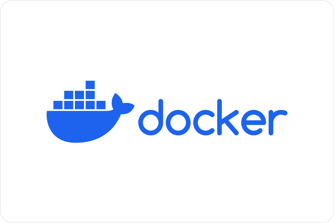
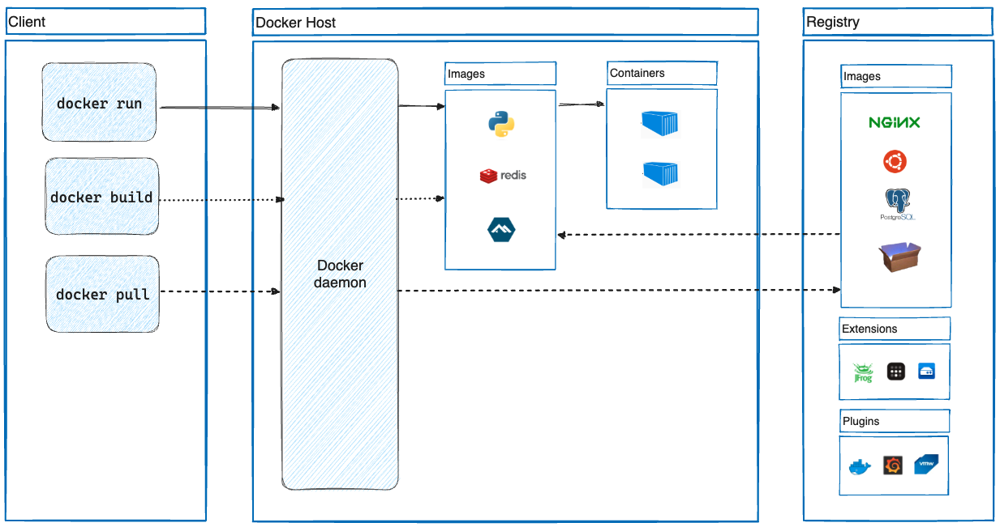
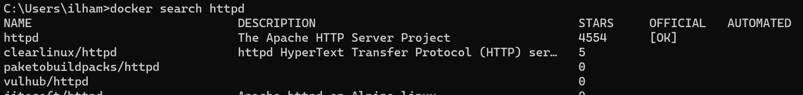
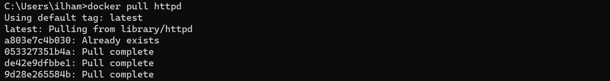
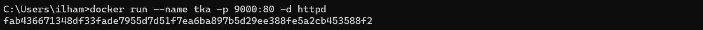
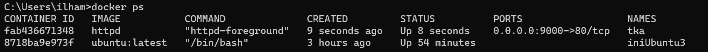
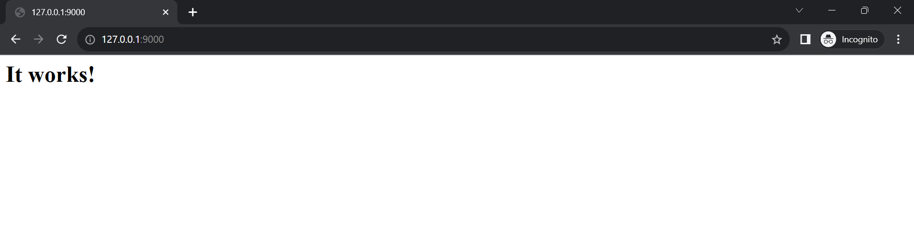
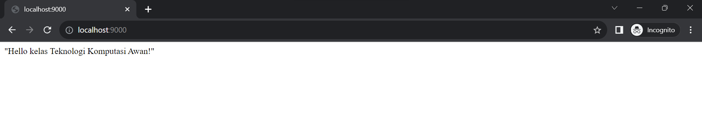
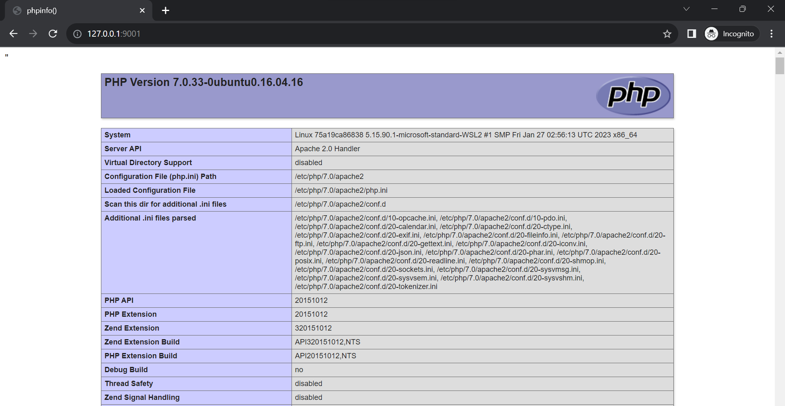
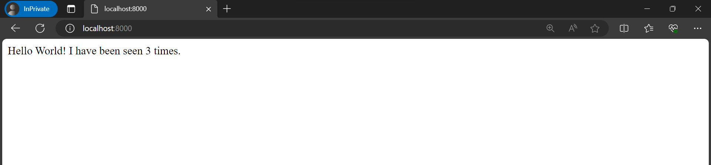

# DOCKER

## A. Virtual Machine vs Container

| Virtual Machine | Container |
|-----------------|-----------|
|  |  |

### A.1 Virtual Machine

Virtual Machine (VM) merupakan abstraksi perangkat keras fisik yang mengubah satu server menjadi banyak server. Untuk mengatur VM dibutuhkan *virtual machine manager* atau *hypervisor*. Dengan menggunakan *hypervisor* memungkinkan untuk membagi sumber daya dan mengalokasikannya ke beberapa VM yang berbeda. Setiap kali membuat VM, diharuskan juga menginstall sistem operasinya. Hal ini akan menyebabkan ukuran aplikasi menjadi lebih besar karena di dalamnya terdapat aplikasi, dependensi beserta sistem operasinya (VM dapat berukuran lebih dari 1 GB).

### A.2 Container

Container adalah abstraksi pada lapisan aplikasi yang mengemas kode dan *dependencies* secara bersamaan. Untuk mengatur container dibutuhkan *container manager*. Dengan menggunakan container memungkinkan untuk menjalankan beberapa container berjalan di mesin yang sama dan berbagu OS dengan container lainnya. Selain itu, *container manager* bertugas juga untuk melakukan isolasi pada setiap container. Dengan menggunakan container, *resource* yang dipakai lebih sedikit ketimbang menggunakan VM (container dapat berukuran puluhan MB saja).

## B. Installasi Docker

**Docker Desktop (Windows, Mac, Linux)**
1. Download [docker desktop](https://www.docker.com/products/docker-desktop/).
2. Buka file installer yang telah diunduh, kemudian ikuti panduan instalasi yang muncul. Ini akan menginstal Docker Desktop ke komputer Anda.
3. Jalankan Docker Desktop.
4. Cek versi docke dengan perintah 
    ```docker
    docker --version
    ```
5. Selanjutnya, jalankan perintah berikut untuk memeriksa apakah Docker dapat menjalankan kontainer Hello World:
    ```docker
    docker run hello-world
    ```
6. Jika semuanya berjalan dengan baik, Anda akan melihat pesan yang mengkonfirmasi bahwa Docker telah diinstal dengan sukses.

Jika kamu masih mengalami kesulitan dalam menginstall docker, kamu dapat melihat [tautan video di youtube berikut](https://youtu.be/XgRGI0Pw2mM?si=13mKwmYt_KhsRNni)

**Linux**
1. Lakukan instalasi [Docker Engine](https://docs.docker.com/engine/install/ubuntu/#install-using-the-repository) 

    Lakukan instalasi sampai [post-installation steps for Linux](https://docs.docker.com/engine/install/linux-postinstall/).
    
2. Setelah itu, install [Docker Compose](https://docs.docker.com/compose/install/#linux)

## C. Docker


### C.1 Apa itu Docker?

Docker merupakan layanan *open-source* yang dapat mengemas serta menjalan aplikasi dengan lingkungan yang terisolasi. Dengan mengisolasi aplikasi, memungkinkan *developer* untuk menjalankan banyak container pada waktu bersamaan. Untuk mengisolasi setiap aplikasi, di docker menggunakan container. Penggunaan container juga memungkinkan *developer* untuk menjalankan aplikasi di berbagai lingkungan.


### C.2 Arsitektur Docker



Docker menggunakan arsitektur *client-server*. Docker client bertugas menerima perintah pengguna dan mengirimkannya ke Docker daemon untuk menjalan perintah tersebut seperti *building*, *running*, dan *distributing* Docker container pengguna. Docker client dan daemon berjalan pada sistem yang sama, atau dapat menyambungkan Docker client dengan Docker daemon secara *remote*. Docker client dan daemon berkomunikasi menggunakan REST API, melalui soket UNIX atau *network interface*. Selain itu, juga terdapat Docker Compose yang memungkinkan bekerja dengan aplikasi yang terdiri atas sekumpulan container.

**Docker Daemon**

Docker Daemon (`dockerd`) mendengarkan Docker API *requests* dan mengelola objek Docker seperti image, container, jaringan, dan volume. Sebuah Docker daemon juga dapat berkomunikasi dengan daemon lain untuk mengelola layanan docker.

**Docker Client**

Docker Client (`docker`) merupakan interface pengguna untuk berinteraksi dengan Docker. Contohnya ketika pengguna memberikan input `docker run`, Docker client mengirim perintah ini ke `dockerd`, dan menjalankannya. Perintah Docker menggunakan Docker API. Docker Client dapat berkomunikasi dengan lebih dari satu daemon.

**Docker Desktop**

Docker Desktop adalah aplikasi Docker yang dipasang pada Mac, Windows, atau Linux *environment* yang memungkinkan untuk membangun dan berbagi aplikasi dan layanan mikro yang terkontainerisasi. Docker desktop mencakup Docker daemon (`dockerd`), Docker client (`docker`), Docker compose, Docker content trust, kubernetes, dan credential helper.

**Docker Registry**

Docker Registry adalah tempat untuk menyimpan Docker Image. Dengan menggunakan Docker Registry, pengguna dapat menyimpan Image yang dibuat, dan dapat digunakan di Docker Daemon dimanapun selama terkoneksi ke Docker Registry. 

Saat menggunakan perintah `docker pull` atau `docker run`, Docker melakukan pull image yang dibutuhkan dari registry yang dikonfigurasikan. Saat menggunakan perintah `docker push`, Docker melakukan push image ke registry yang telah dikonfigurasi. Berikut contoh-contoh Docker Registry:
- [Docker Hub](https://hub.docker.com/) (default)
- [Digital Ocean Container Registry](https://www.digitalocean.com/products/container-registry/)
- [Google Cloud Container Registry](https://cloud.google.com/container-registry)
- [Amazon Elastic Container Registry](https://aws.amazon.com/id/ecr/)
- [Azure Container Registry](https://azure.microsoft.com/en-us/services/container-registry/)

<br>

**Docker Objects**

Docker Object merupakan komponen-komponen pada docker, seperti image, container, network, volume, plugin, dan lain-lain.

## D. Docker Image

Docker Image adalah *read-only template* yang berisi instruksi untuk membuat Docker Container. Image berisi intruksi untuk menjalankan aplikasi bersama dengan konfigurasi yang diperlukan. Image dapat mengambil milik orang lain di Docker Hub atau dapat dibuat sendiri menggunakan Dockerfile. Pastikan mempunyai Image aplikasi sebelum aplikasi tersebut dijalankan di Docker.

### Perintah Docker Image

Berikut beberapa perintah pada Docker Image untuk mengelola image.

> Penggunaan: `docker image COMMAND`

| Perintah  | Keterangan |
| --- | --- |
| `build` | Untuk membuat sebuah image dari sebuah Dockerfile |
| `history` | Untuk melihat history sebuah image |
| `import` | Untuk import image untuk membuat sebuah filesystem image |
| `inspect` | Untuk melihat informasi detail dari satu atau beberapa image |
| `load` | Untuk memuat image dari sebuah tar arsip atau STDIN |
| `ls` | Untuk melihat daftar image |
| `prune` | Untuk menghapus image yang tidak digunakan |
| `pull` | Untuk mengunduh image dari registry |
| `push` | Untuk mengunggah image ke regisry |
| `rm` | Untuk menghapus satu atau beberapa image |
| `save` | Untuk menyimpan satu atau lebih image ke dalam sebuah tar arsip |
| `tag` | Untuk membuat sebuah tag TARGET_IMAGE yang merujuk ke SOURCE_CODE |

Contoh:

```docker
# mencari image
docker search [imageName]

# list image
docker image ls

# download image
docker image pull [imageName]:[tag] 
docker pull [imageName]:[tag] 
docker pull httpd
```





## E. Docker Container

Docker Container adalah instance image yang dijalankan. Container berisi aplikasi dan dependensinya. dimana setiap container terisolasi dengan host maupun container lainnya. Setiap container berjalan dalam lingkungan yang terisolasi dengan container lainnya dan dari host sistem operasi. Container berbagi dengan kernel host, yang membuat mereka sangat efisien dalam penggunaan sumber daya dan cepat dalam menjalankannya. Container Docker juga memiliki tingkat portabilitas yang tinggi, memungkinkan pengguna untuk membuat container dalam lingkungan pengembangan dan dengan mudah menjalankannya dalam lingkungan produksi dengan cara yang konsisten.

### Perintah Docker Container

Berikut beberapa perintah pada Docker Container untuk mengelola container.

> Penggunaan: `docker container COMMAND`

| Perintah | Keterangan |
| --- | --- |
| `attach` | Untuk masuk pada terminal container yang sedang berjalan |
| `commit` | Untuk membuat image baru dari perubahan sebuah container |
| `cp` | Untuk menyalin file/folder antara file sistem host dan file sistem container |
| `create` | Untuk membuat container baru |
| `diff` | Untuk memeriksa perubahan pada file atau direktori di file sistem container |
| `exec` | Untuk menjalankan perintah dalam container yang sedang berjalan |
| `export` | Untuk mengekspor container file sebagai arsip tar |
| `inspect` | Untuk menampilkan informasi detail pada satu atau beberapa container |
| `kill` | Untuk menghentikan satu atau beberapa kontainer yang sedang berjalan secara paksa |
| `logs` | Untuk mengambil log dari sebuah container |
| `ls` | Untuk melihat daftar container yang sedang berjalan |
| `pause` | Untuk menghentikan sementara semua proses pada satu atau beberapa container |
| `port` | Untuk melihat daftar pemetaan port atau pemetaan spesifik pada container |
| `prune` | Untuk menghapus semua container yang tidak berjalan |
| `rename` | Untuk mengubah nama container |
| `restart` | Untuk memulai ulang satu atau beberapa container |
| `rm` | Untuk menghapus satu atau beberapa container |
| `run` | Untuk membuat dan menjalankan container baru dari sebuah image |
| `start` | Untuk memulai satu atau lebih container yang dihentikan |
| `stats` | Untuk menampilkan informasi statistik penggunaan sumber daya container |
| `stop` | Untuk menghentikan satu atau beberapa container yang sedang berjalan |
| `top` | Untuk menampilkan proses yang sedang berjalan dari sebuah container |
| `unpause` | Untuk meneruskan proses pada satu atau beberapa container yang sebelumnya dihentikan sementara |
| `update` | Untuk memperbarui konfigurasi satu atau beberapa container |
| `wait` | untuk menunggu sampai suatu kontainer selesai berjalan dan kemudian mengembalikan kode keluaran (exit code) dari kontainer tersebut |

Contoh:

```docker
# list container yang sedang dan tidak berjalan 
docker container ls -a
docker ps -a

# memulai/ menjalankkan container
docker container start [containerId/containerName]
docker start [containerId/containerName]

# membuat dan menjalankan container
docker run [options] [image] [command] [arg..]
docker run -itd --name container1 ubuntu:latest

# melihat log secara realtime
docker container logs -f [containerId/containerName]

# untuk mengeksekusi perintah ke dalam container 
docker container exec [options] [containerId/containerName] [command]
docker container exec -i -t container1 /bin/bash
docker exec d87283c0e4d7 ls /etc/nginx

# membuat container baru menggunakan base image httpd
docker run --name tka -p 9000:80 -d httpd
# Keterangan:
# --name : untuk memberikan nama pada container
# -p     : sebagai port forwarding (9000 port host, 80 port container)
# -d     : image container dijalankan sebagai servis
```








## F. Docker Volume

Docker volume adalah sebuah mekanisme dalam Docker yang digunakan untuk menyimpan dan mengelola data persisten yang digunakan oleh container. Docker Volume diterapkan untuk menyimpan data atau state karena docker tidak menyimpan state. Docker Volume digunakan untuk memisahkan data yang perlu bertahan lebih lama dan harus diakses oleh satu atau beberapa kontainer dari lingkungan yang bersifat efemeral. Berikut merupakan langkah-langkah untuk mengaktifkan volume:

1. Matikan dan hapus kotnainer yang telah kita buat sebelumnya.
    
    ```docker
     docker stop tka
     docker rm tka
    ```
    
2. Buat folder baru bernama src dan tambahkan file `index.html`
    
    ```docker
     mkdir tka
     echo "Hello kelas Teknologi Komputasi Awan!" > tka/index.html
    ```
    
3. Buat dan jalankan container.
    
    ```docker
    # linux
    docker run --name tka -v "$PWD"/tka:/usr/local/apache2/htdocs/ -p 9000:80 -d httpd
    
    # windows
    docker run --name tka -v %CD%/tka:/usr/local/apache2/htdocs/ -p 9000:80 -d httpd
    ```
    
    Keterangan:
    
    - Argument -v untuk menambahkan docker volume.
    - perintah **"$PWD"/src:/usr/local/apache2/htdocs/**, akan menghubungkan folder src ke folder htdocs pada kontainer. Perintah **"$PWD"** digunakan untuk mendapatkan posisi folder saat ini.
4. Buka browser dan akses **[http://localhost:9000](http://localhost:9000/)**



### Perintah Docker Volume

> Penggunaan: `docker volume COMMAND`

| Perintah | Keterangan |
| --- | --- |
| `create` | Untuk membuat sebuah volume |
| `inspect` | Untuk menampilkan detail informasi satu atau beberapa volume |
| `ls` | Untuk melihat daftar volume |
| `prune` | Untuk menghapus volume yang tidak digunakan |
| `rm` | Untuk menghapus satu atau beberapa volume |
| `update` | Untuk melakukan update volume |

Contoh:

```docker
docker volume ls
docker volume create tka
```

## G. Dockerfile

Docker dapat menghasilkan gambar secara otomatis dengan memproses instruksi yang terkandung dalam Dockerfile. Dockerfile adalah sebuah dokumen berbasis teks yang berisi serangkaian perintah yang mengarah pada pembuatan gambar Docker. Dalam Dockerfile, terdapat urutan langkah yang harus dijalankan oleh Docker Engine untuk menciptakan sebuah gambar yang dapat digunakan sebagai dasar untuk menjalankan kontainer. Dockerfile berfungsi sebagai panduan yang merincikan konfigurasi dan dependensi yang diperlukan untuk menjalankan aplikasi atau layanan dalam lingkungan kontainer.
### Perintah Dockerfile

Berikut beberapa perintah pada Dockerfile.

| Perintah  | Keterangan |
| --- | --- |
| `FROM` | Untuk menentukan base/parent image yang akan digunakan |
| `COPY` | Untuk menyalin file atau folder ke dalam image |
| `ADD` | Untuk menyalin file atau folder ke dalam image |
| `RUN` | Untuk menjalankan perintah shell di dalam gambar selama proses build |
| `CMD` | Untuk mendefinisikan perintah default saat menjalankan container |
| `ENTRYPOINT` | Untuk mendefinisikan perintah yang akan dijalankan (perintah inti) |
| `ENV` | Untuk mendefinisikan environment variable |
| `EXPOSE` | Untuk mendefinisikan port yang akan di-expose dari container ke host |
| `VOLUME` | Untuk mendefinisikan volume yang akan digunakan container |

[Penjelasan lebih lanjut](https://docs.docker.com/engine/reference/builder/)

### Contoh Dockerfile

1. Buatlah folder bernama `www`
    
    ```docker
     mkdir www
    
    ```
    
2. Buatlah file `index.php` di dalam folder `www`
    
    ```docker
     echo "<?php phpinfo(); ?>" > www/index.php
    
    ```
    
3. Buat Dockerfile dengan isi sebagai berikut:
    
    ```docker
     FROM ubuntu:16.04
    
     RUN apt-get update && apt-get install -y apache2 php7.0 php7.0-fpm libapache2-mod-php && apt-get clean && rm -rf /var/lib/apt/lists/*
    
     COPY www/index.php /var/www/html
    
     WORKDIR /var/www/html
    
     RUN rm index.html
    
     WORKDIR /
    
     CMD ["apachectl", "-D", "FOREGROUND"]
    
     EXPOSE 80
    
    ```
    
4. Buat image dengan perintah
    
    ```docker
     docker build -t ubuntu-tka-image ./
    
    ```
    
5. Buat container baru dengan perintah
    
    ```docker
     docker run --name ubuntu-tka-container -p 9001:80 -d ubuntu-tka-image
    ```
    
6. Cek pada browser

    

## H. Docker Compose

Docker Compose merupakan tool yang digunkan untuk mendefinisikan dan menjalankan aplikasi yang terdiri dari beberapa container secara sekaligus menggunakan file YAML. Docker Compose mempermudah dalam mengelola aplikasi yang terdiri dari berbagai layanan yang harus berinteraksi satu sama lain. Docker Compose berjalan di semua lingkungan; *production*, *staging*, *development*, *pengujian*, serta *CI workflows*. Docker Compose juga memiliki perintah untuk mengelola seluruh siklus hidup aplikasi:

- Start, stop, dan rebuild service.
- Melihat status layanan yang sedang berjalan.
- Stream log output dari layanan yang sedang berjalan.
- Menjalankan perintah satu kali pada sebuah layanan.

### Contoh Implementasi

**Step 1: Define the application dependencies**

1. Membuat direktori `composetest`:

    ```docker
    mkdir composetest
    cd composetest
    ```

2. Buat file bernama `app.py`di direktori proyek dan copy kode berikut:
    
    ```python
    import time
    
    import redis
    from flask import Flask
    
    app = Flask(__name__)
    cache = redis.Redis(host='redis', port=6379)
    
    def get_hit_count():
        retries = 5
        while True:
            try:
                return cache.incr('hits')
            except redis.exceptions.ConnectionError as exc:
                if retries == 0:
                    raise exc
                retries -= 1
                time.sleep(0.5)
    
    @app.route('/')
    def hello():
        count = get_hit_count()
        return 'Hello World! I have been seen {} times.\n'.format(count)
    ```
    
    Dalam contoh ini, `redis`adalah nama host container redis di jaringan aplikasi. Port default Redis adalah `6379`.
    
2. Buat file `requirements.txt`di direktori proyek Anda dan tempelkan kode berikut di:

    ```docker
    flask
    redis
    ```

**Step 2: Create a Dockerfile**

Buat Docker Image menggunakan Dockerfile.

```docker
# syntax=docker/dockerfile:1
FROM python:3.7-alpine
WORKDIR /code
ENV FLASK_APP=app.py
ENV FLASK_RUN_HOST=0.0.0.0
RUN apk add --no-cache gcc musl-dev linux-headers
COPY requirements.txt requirements.txt
RUN pip install -r requirements.txt
EXPOSE 5000
COPY . .
CMD ["flask", "run"]
```

Keterangan:
- Build image dengan base image Python 3.7.
- Set working direktori ke `/code`.
- Set environment variables yang digunakan oleh perintah `flask` .
- Install `gcc` dan dependensi lainnya.
- Copy `requirements.txt` and install Python dependensi.
- Menambahkan port 5000
- Copy  direktori saat ini `.`  ke dalam working direktori image.
- Set default command untuk container untuk `flask run`.

**Step 3: Define services in a Compose file**

Buat sebuah file bernama `compose.yaml` di direktori proyek Anda dan paste kode berikut:

```docker
services:
  web:
    build: .
    ports:
      - "8000:5000"
  redis:
    image: "redis:alpine"
```

File compose ini berisi dua layanan, yaitu web dan redis.

`web` services menggunakan Image yang dibuat dari file `Dockerfile` di direktori saat ini. Lalu, ia bind container dan host machine ke port `8000`. Pada contoh ini menggunakan port default untuk server web Flask, `5000`.

`redis` services menggunakan public Redis Image.

**Step 4: Build and run your app with Compose**

1. Start aplikasi dengan menjalankan perintah.
    
    ```docker
    docker compose up
    ```
    
2. Cek pada browser untuk melihat aplikasi yang sedang berjalan. 
`http://localhost:8000/` atau `http://127.0.0.1:8000`
  


## I. Latihan Soal

1.  Buatlah container menggunakan base image `nginx`, serta definisikan port `5000` agar bisa diakses melalui localhost, dan jangan lupa untuk stop dan remove setelah berhasil
2.  Buatlah Dockerfile dengan base Image adalah `python:3.8` dan file `index.py` di dalam folder www dengan tulisan `"Hello world"`. Atur direktori di /var/www/html serta definisikan port `5003`. Setelah itu, cobalah akses pada port `5003`
  

## Reference

[Reference documentation | Docker Docs](https://docs.docker.com/reference/)

[cloud-2018/docker at master · fathoniadi/cloud-2018 (github.com)](https://github.com/fathoniadi/cloud-2018/tree/master/docker)
