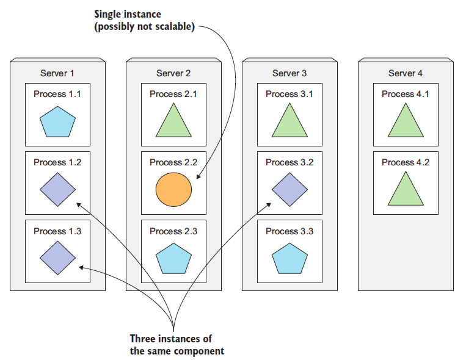
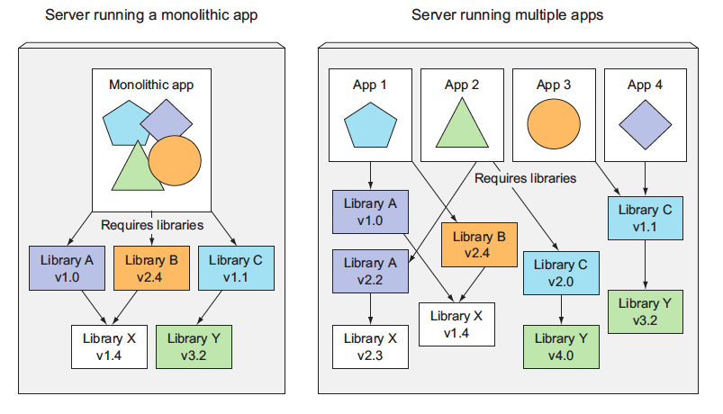

# Kubernetes

## Daftar Isi
+ A. [Apa itu Kubernetes?](#a-apa-itu-kubernetes)
+ B. [Installasi minikube dan kubectl](#b-installasi-minikube-dan-kubectl)
+ C. [Dasar Teori](#c-dasar-teori)
+ D. [Instalasi Lynx](#d-instalasi-lynx)
+ E. [Instalasi Apache](#e-instalasi-apache)
+ F. [Instalasi PHP](#f-instalasi-php)
+ G. [Mengenal Apache](#g-mengenal-apache)
+ H. [Konfigurasi Apache Sederhana](#h-konfigurasi-apache-sederhana)
  + A. [Penggunaan Sederhana](#a-penggunaan-sederhana)
  + B. [Membuat Konfigurasi Website Menggunakan Port 8080](#b-membuat-konfigurasi-website-menggunakan-port-8080)
+ I. [Mari Berimajinasi](#i-mari-berimajinasi)
  + A. [Setting Domain pada Apache](#a-setting-domain-pada-apache)
  + B. [Directory Listing](#b-directory-listing)
  + C. [Directory Alias](#c-directory-alias)
  + D. [Module Rewrite](#d-module-rewrite)
+ J. [Nginx Web Server](#4-nginx-web-server)
  + A. [Instalasi Nginx](#a-instalasi-nginx)
  + B. [Nginx Load Balancing](#b-load-balancing-pada-nginx)
  + C. [Nginx Upstream](#c-upstream)
  + D. [Reverse Proxy](#d-reverse-proxy)
  + E. [Setup Load Balancing di Nginx](#e-setup-load-balancing-di-nginx)

## A. Apa itu Kubernetes?
Dalam beberapa tahun terakhir, dunia pengembangan perangkat lunak telah menyaksikan pergeseran signifikan dari aplikasi monolitik tradisional ke paradigma layanan mikro, yang memungkinkan komponen aplikasi untuk dikembangkan, diterapkan, dan diskalakan secara individual, sehingga lebih responsif terhadap kebutuhan bisnis yang terus berubah. Arsitektur layanan mikro, meskipun menawarkan fleksibilitas dan skalabilitas, juga membawa tantangan baru dalam hal konfigurasi, pengawasan, dan penanganan kegagalan sistem, terutama karena peningkatan jumlah komponen dan kompleksitas pengelolaan pusat data. Kubernetes, sebuah platform orkestrasi kontainer terbuka, muncul sebagai jawaban atas tantangan ini, menyediakan mekanisme untuk mengelola dan menjadwalkan komponen aplikasi secara otomatis, serta mengoptimalkan penggunaan sumber daya dan biaya perangkat keras. Lebih lanjut, Kubernetes tidak hanya memberdayakan pengembang untuk menerapkan aplikasi dengan kebebasan dan frekuensi yang lebih besar, tetapi juga memberikan nilai tambah kepada tim operasional dengan kemampuannya untuk secara otomatis memantau, menjadwalkan ulang aplikasi, dan menangani kegagalan perangkat keras, sehingga memungkinkan fokus yang lebih besar pada pengelolaan infrastruktur Kubernetes itu sendiri dan elemen infrastruktur lainnya.

Selanjutnya, kita akan membahas tentang bagaimana kubernetes dapat memisahkan aplikasi menjadi microservices, menskalakan microservices, menerapkan microservices.

### Memisahkan Aplikasi Menjadi Microservices
Setiap microservices sebagai proses independen dan berkomunikasi dengan microservices lainnya melalui antarmuka (API) yang sederhana dan terdefinisi dengan baik. Lihat gambar di bawah ini:


Microservices berkomunikasi menggunakan protokol sinkron seperti HTTP atau protokol asinkron seperti AMQP, seringkali melalui API RESTful, yang sederhana dan tidak terikat pada bahasa pemrograman tertentu, memungkinkan pengembangan dalam berbagai bahasa sesuai kebutuhan. Keunikan microservices sebagai proses mandiri dengan API eksternal yang stabil memungkinkan pengembangan dan penyebaran yang independen; perubahan pada satu layanan tidak memerlukan modifikasi atau penerapan ulang layanan lainnya, selama perubahan API tetap kompatibel.

### Scaling Microservices
Dalam arsitektur microservices, aplikasi dibagi menjadi layanan-layanan kecil yang berfungsi secara independen. Berbeda dengan sistem monolitik yang menskalakan seluruh aplikasi, microservices memungkinkan penskalaan spesifik pada layanan yang mengalami beban tinggi, sementara layanan lain tetap pada kapasitas aslinya. Sebagai contoh, dalam aplikasi e-commerce, jika layanan pencarian produk mengalami lonjakan trafik, hanya layanan tersebut yang perlu diskalakan, tanpa mengganggu layanan pembayaran atau lainnya. Pendekatan ini meningkatkan efisiensi sumber daya dan responsivitas terhadap kebutuhan pengguna. Perhatikan gambar berikut:



Dalam aplikasi monolitik, keterbatasan penskalaan salah satu komponen dapat menghambat penskalaan keseluruhan aplikasi. Dengan pendekatan microservices, aplikasi dibagi menjadi layanan-layanan kecil yang dapat diskalakan secara independen. Jika ada komponen yang sulit diskalakan secara horizontal, kita dapat fokus menskalakannya secara vertikal, sementara komponen lainnya dapat diperluas secara horizontal. Pendekatan ini memberikan fleksibilitas dan optimalisasi dalam penggunaan sumber daya.

### Scaling Microservices
Dalam dunia teknologi, setiap pendekatan memiliki kelebihan dan kekurangannya, termasuk arsitektur microservices. Pada awalnya, ketika sebuah sistem hanya memiliki beberapa komponen, pengelolaan dan penyebarannya relatif sederhana. Dengan sedikit komponen, menentukan penempatan dan interaksi antar komponen menjadi lebih mudah dan intuitif. Namun, seiring bertambahnya jumlah komponen, kompleksitas juga meningkat. Bukan hanya karena ada lebih banyak kombinasi penyebaran, tetapi juga ketergantungan antar komponen tumbuh secara eksponensial, membuat keputusan arsitektural menjadi lebih menantang.

Selain itu, microservices menambahkan lapisan kompleksitas lain dalam hal debugging dan pelacakan. Dengan banyaknya proses dan mesin yang terlibat, melacak alur eksekusi panggilan dapat menjadi tugas yang menantang. Namun, industri teknologi selalu beradaptasi dan mencari solusi. Untuk mengatasi tantangan ini, alat seperti Zipkin telah dikembangkan, yang memungkinkan penelusuran terdistribusi, memberikan wawasan mendalam tentang interaksi antar layanan dalam lingkungan yang kompleks.


> <em>Beberapa aplikasi yang berjalan pada host yang sama mungkin memiliki ketergantungan yang saling bertentangan.</em>

## B. Installasi minikube dan kubectl
Berhubung praktikum sebelumnya sudah melakukan setup untuk Docker, sekarang waktunya melanjutkan menggunakan Docker tersebut dengan kubernetes. Ketika aplikasi yang sudah dibuat sudah dikemas dan dibuat tersedia melalui Docker Hub, aplikasi tersebut dapat dideploy di kluster Kubernetes alih-alih dijalankan di Docker secara langsung. Namun, pertama-tama, kita harus mempersiapkan kluster tersebut terlebih dahulu.

Cara paling sederhana dan tercepat untuk membuat kluster Kubernetes yang berfungsi penuh adalah dengan menggunakan Minikube. Minikube adalah alat yang memungkinkan pengguna untuk menjalankan Kubernetes secara lokal. Dengan Minikube, pengguna dapat mencoba Kubernetes atau mengembangkan aplikasi di lingkungan yang mirip dengan produksi tanpa perlu kluster Kubernetes yang sebenarnya. Minikube berjalan sebagai sebuah kluster Kubernetes single-node di dalam mesin virtual di komputer, memudahkan untuk memulai eksperimen dengan Kubernetes tanpa investasi infrastruktur yang besar.

Kubectl, di sisi lain, adalah Command Line Interface (CLI) untuk berinteraksi dengan kluster Kubernetes. Ini adalah alat esensial bagi siapa saja yang bekerja dengan Kubernetes, memungkinkan pengguna untuk menjalankan command terhadap kluster, seperti membuat dan menghapus sumber daya, melihat status node dan pod, serta banyak lagi. Dengan kubectl, pengguna dapat mengelola kluster dan aplikasi yang berjalan di dalamnya dengan mudah dan efisien.

### 1. Proses Installasi kubectl

#### Sebelum Memulai
Gunakan versi kubectl yang berada dalam satu perbedaan versi minor dari kluster. Misalnya, klien v1.28 dapat berkomunikasi dengan v1.27, v1.28, dan v1.29. Menggunakan kubectl versi terbaru yang kompatibel membantu menghindari masalah yang tidak terduga.

#### A. Install kubectl di Linux
Terdapat 3 cara untuk menginstall kubectl di Linux. Cara tersebut adalah dengan menggunakan curl, npm, dan package management lain. Untuk kali ini akan digunakan cara curl.

1. Download versi terbaru dengan command:
```
curl -LO "https://dl.k8s.io/release/$(curl -L -s https://dl.k8s.io/release/stable.txt)/bin/linux/amd64/kubectl"
```
2. Validasi biner. Download file checksum kubectl:
```
curl -LO "https://dl.k8s.io/release/$(curl -L -s https://dl.k8s.io/release/stable.txt)/bin/linux/amd64/kubectl.sha256"
```
3. Validasi biner kubectl terhadap file checksum:
```
echo "$(cat kubectl.sha256)  kubectl" | sha256sum --check
```
Jika valid, maka outputnya adalah:
```
kubectl: OK
```
Jika gagal, outputnya adalah:
```
kubectl: FAILED
sha256sum: WARNING: 1 computed checksum did NOT match
```
4. Install kubectl
```
sudo install -o root -g root -m 0755 kubectl /usr/local/bin/kubectl
```
5. Tes untuk memastikan versi yang diinstall up to date:
```
kubectl version --client
```
#### B. Install kubectl di macOS
Terdapat 3 cara untuk menginstall kubectl di macOS. Cara tersebut adalah dengan menggunakan curl, Homebrew, dan Macports. Untuk kali ini akan digunakan cara Homebrew.

1. Download versi terbaru dengan command:
```
brew install kubectl
```
2. Tes untuk memastikan versi yang diinstall up to date:
```
kubectl version --client
```
#### C. Install kubectl di Windows
Terdapat 2 cara untuk menginstall kubectl di macOS. Cara tersebut adalah dengan menggunakan curl dan winget. Untuk kali ini akan digunakan cara curl.

1. Download versi terbaru dengan command:
```
curl.exe -LO "https://dl.k8s.io/release/v1.28.3/bin/windows/amd64/kubectl.exe"
```
2. Validasi biner. Download file checksum kubectl:
```
curl.exe -LO "https://dl.k8s.io/v1.28.3/bin/windows/amd64/kubectl.exe.sha256"
```
3. Validasi biner kubectl terhadap file checksum. Gunakan Command Prompt untuk membandingkan output CertUtil's secara manual dengan file checksum yang diumduh:
```
CertUtil -hashfile kubectl.exe SHA256
type kubectl.exe.sha256
```
Gunakan PowerShell untuk mengotomatiskan verifikasi menggunakan operator -eq untuk mendapatkan hasil True atau False
```
$(Get-FileHash -Algorithm SHA256 .\kubectl.exe).Hash -eq $(Get-Content .\kubectl.exe.sha256)
```
4. Append folder binary kubectl ke variabel environment PATH
5. Tes untuk memastikan versi yang diinstall up to date:
```
kubectl version --client
```
#### D. Installasi Minikube
1. Di linux, gunakan command:
```
curl -LO https://storage.googleapis.com/minikube/releases/latest/minikube-linux-amd64
sudo install minikube-linux-amd64 /usr/local/bin/minikube
```
2. Di macOS, gunakan homebrew dan inputkan command:
```
brew install minikube
```
3. Di Windows, cukup download dan jalankan installer untuk versi terbaru. Jika ingin menggunakan PowerShell, inputkan command:
```
New-Item -Path 'c:\' -Name 'minikube' -ItemType Directory -Force
Invoke-WebRequest -OutFile 'c:\minikube\minikube.exe' -Uri 'https://github.com/kubernetes/minikube/releases/latest/download/minikube-windows-amd64.exe' -UseBasicParsing
```
Tambahkan minikube.exe bianry ke PATH. Pastikan PowerShell berhalan sebagai Administrator:
```
New-Item -Path 'c:F\' -Name 'minikube' -ItemType Directory -Force
Invoke-WebRequest -OutFile 'c:\minikube\minikube.exe' -Uri 'https://github.com/kubernetes/minikube/releases/latest/download/minikube-windows-amd64.exe' -UseBasicParsing
```

## C. Menjalankan Kluster Single Node Kubernetes dengan Minikube
Setelah installasi minikube sudah dilakukan, mulai kluster Kubernetes dengan command berikut:
```
minikube start
```
Outputnya nanti adalah:
```bash
Starting local Kubernetes cluster...
Starting VM...
SSH-ing files into VM...
...
Kubectl is now configured to use the cluster.
```
Proses untuk menyalakan kluster memakan waktu lebih dari 1 menit, jadi jangan interupsi command sebelum selesai

## D. Mengecek Kluster dan Kubernetes
Untuk memverifikasi apakah kluster telah bekerja, gunakan command kubectl berikut:
```
kubectl cluster-info
```
Outputnya nanti adalah 

```bash
Kubernetes master is running at https://192.168.99.100:8443

kubernetes-dashboard is running at https://192.168.99.100:8443/api/v1/...

KubeDNS is running at https://192.168.99.100:8443/api/v1/namespaces/kube-system/services/kube-dns:dns/proxy
```
Output tersebut menunjukkan bahwa kluster telah berjalan. Selain itu, akan ditunjukkan URL dari berbagai komponen kubernetes, termasuk server API dan web console.

## E. Deploy Aplikasi
Cara yang paling mudah untuk mendeploy aplikasi adalah dengan menggunakan command **kubectl create**. Dengan ini, aplikasi akan terdeploy dengan komponen yang sesuai tanpa harus mengurus JSON atau YAML:
```bash
kubectl create deployment kubia --image=knrt10/kubia --port=8080
```
Bagian `--image=knrt10/kubia` menentukan citra kontainer yang ingin dijalankan, dan opsi `--port=8080` memberi tahu Kubernetes bahwa aplikasi mendengarkan pada port 8080.

## F. Listing Pods
Cara yang paling mudah untuk mendeploy aplikasi adalah dengan menggunakan command **kubectl create**. Dengan ini, aplikasi akan terdeploy dengan komponen yang sesuai tanpa harus mengurus JSON atau YAML:
```bash
kubectl create deployment kubia --image=knrt10/kubia --port=8080
```
Bagian `--image=knrt10/kubia` menentukan citra kontainer yang ingin dijalankan, dan opsi `--port=8080` memberi tahu Kubernetes bahwa aplikasi mendengarkan pada port 8080.

## G. Akses Web Aplikasi
Setelah pod berjalan, bagaimana cara mengaksesnya? Setiap pod mendapatkan alamat IP-nya sendiri, tetapi alamat ini bersifat internal dalam kluster dan tidak dapat diakses dari luar kluster. Untuk membuat pod dapat diakses dari luar ekspos melalui Service Object. 

Buat layanan khusus bertipe LoadBalancer karena jika membuat layanan biasa (layanan ClusterIP), sebagai pod, layanan ini juga hanya dapat diakses dari dalam kluster. Dengan membuat layanan tipe LoadBalancer, sebuah load balancer eksternal akan dibuat dan dapat terhubung ke pod melalui IP publik load balancer.

## H. Membuat Service Object
Untuk membuat layanan, beri tahu Kubernetes untuk mengekspos Deployment yang telah dibuat sebelumnya:

```bash
kubectl expose deploy kubia --type=LoadBalancer --name kubia-http
```
Outputnya nanti adalah:
```
service/kubia-http exposed
```

**Penting:** Gunakan singkatan `deploy`, bukan `deployment`. Sebagian besar jenis sumber daya memiliki singkatan seperti ini sehingga tidak perlu mengetikkan nama lengkapnya (misalnya, `po` untuk `pods`, `svc` untuk `services`, dan seterusnya).

## I. Listing Services
Output command tersebut menyebutkan sebuah layanan bernama `kubia-http`. Layanan adalah objek seperti halnya Pod dan Node, sehingga dapat dilihat Service Object yang baru dibuat dengan menjalankan command **kubectl get services | svc**, seperti yang ditunjukkan pada listing berikut:
```bash
kubectl get svc
```
Outputnya nanti adalah:
 ```
 NAME         TYPE           CLUSTER-IP     EXTERNAL-IP   PORT(S)          AGE
kubernetes   ClusterIP      10.96.0.1      <none>        443/TCP          30h
kubia-http   LoadBalancer   10.107.88.67   <pending>     8080:32718/TCP   81s
```

**Penting**: - Minikube tidak mendukung layanan LoadBalancer, jadi layanan ini tidak akan pernah mendapatkan IP eksternal.Tetapi layanan ini dapat diakses melalui port eksternalnya. Jadi IP eksternal akan selalu pending dalam hal ini. Ketika menggunakan minikube, bisa didapatkan IP dan port melalui akses services dengan menjalankan command:
```
minikube service kubia-http
```

## J. Scaling Microservices Secara Horizontal
Salah satu kelebihan Kubernetes adalah kemudahan untuk melakukan scaling deployment. Disini akan ditingkatkan jumlah instance yang berjalan menjadi tiga. Gunakan command:
```
kubectl get deploy
```
```bash
NAME    READY   UP-TO-DATE   AVAILABLE   AGE
kubia   1/1     1            1           4m58s
```

Untuk meningkatkan jumlah replika pod yang dibuat, gunakan command:
```
kubectl scale deploy kubia --replicas=3
```
Outputnya nanti adalah:
```
deployment.apps/kubia scaled
```

Listing lagi deployment yang sudah dibuat untuk melihat jumlah replica dengan command:
```
kubectl get deploy
```
Outputnya nanti adalah:
```bash
NAME    READY   UP-TO-DATE   AVAILABLE   AGE
kubia   3/3     3            3           6m43s
```

Karena jumlah pod telah meningkat ke tiga, listing semua pod dengan command berikut. Akan ditunjukkan bahwa terdapat 3 pods, bukan 1:
```
kubectl get pods
```
Outputnya nanti adalah:
```bash
NAME                     READY   STATUS    RESTARTS   AGE
kubia-57c4d74858-d284g   1/1     Running   0          94s
kubia-57c4d74858-tflb8   1/1     Running   0          7m9s
kubia-57c4d74858-wfgmb   1/1     Running   0          94s
```

## K. Menunjukkan Informasi IP Pod dan Node Pod Ketika Listing
Jika diperhatikan dengan seksama, command **kubectl get pods**  tidak menampilkan informasi apa pun tentang node yang dijadwalkan untuk pod. Ini karena informasi ini biasanya bukan informasi yang penting.

Tetapi dapat diminta kolom tambahan untuk ditampilkan menggunakan opsi **-o wide**. Saat listing, opsi ini menunjukkan IP pod dan node tempat pod berjalan:
```
kubectl get pods -o wide
```
Outputnya nanti adalah:
```bash
$ kubectl get pods -o wide
NAME                     READY   STATUS    RESTARTS   AGE     IP           NODE       NOMINATED NODE   READINESS GATES
kubia-57c4d74858-d284g   1/1     Running   0          2m53s   172.17.0.5   minikube   <none>           <none>
kubia-57c4d74858-tflb8   1/1     Running   0          8m28s   172.17.0.3   minikube   <none>           <none>
kubia-57c4d74858-wfgmb   1/1     Running   0          2m53s   172.17.0.4   minikube   <none>           <none>
```

## L. Mengakses Dashboard Menggunakan Minikube
Untuk membuka dashboard di browser ketika menggunakan minikube untuk menjalankan kluster kubernetes, jalankan command berikut:
```
minikube dashboard
```

## M. Pods
Pod dan sumber daya Kubernetes lainnya biasanya dibuat dengan mem-posting manifes JSON atau YAML ke titik akhir REST API Kubernetes. Selain itu, dengan menggunakan cara lain yang lebih sederhana untuk membuat sumber daya, adalah dengan command **kubectl run**, tetapi cara ini biasanya hanya mengizinkan untuk mengonfigurasi sekumpulan properti yang terbatas, tidak semuanya. Selain itu, mendefinisikan semua objek Kubernetes dari file YAML memungkinkan untuk menyimpannya dalam sistem kontrol versi, dengan semua manfaat yang dimilikinya.

Untuk memeriksa deskriptor YAML dari pod yang ada, gunakan command **kubectl get** dengan opsi **-o yaml** untuk mendapatkan seluruh definisi YAML dari pod, atau dapat menggunakan **-o json** untuk mendapatkan seluruh definisi JSON sebagai ditampilkan dalam listing berikut.
```
kubectl get po kubia-bsksp -o yaml
```

Definisi pod terdiri dari beberapa bagian. Pertama, versi API Kubernetes yang digunakan di YAML dan jenis sumber daya yang dijelaskan oleh YAML. Lalu, tiga bagian penting ditemukan di hampir semua sumber daya Kubernetes:

- **Metadata** mencakup nama, namespace, label, dan informasi lain tentang pod.
- **Spesifikasi** berisi deskripsi sebenarnya dari isi pod, seperti container pod, volume, dan data lainnya.
- **Status** berisi informasi terkini tentang pod yang berjalan, seperti kondisi pod, deskripsi dan status setiap container, serta IP internal pod dan informasi dasar lainnya.

Bagian status berisi data runtime read-only yang menunjukkan status sumber daya pada saat tertentu. Saat membuat pod baru, tidak perlu menyediakan bagian status.

Tiga bagian yang dijelaskan sebelumnya menunjukkan struktur khas objek API Kubernetes. Semua objek lainnya memiliki anatomi yang sama sehingga memudahkan pemahaman objek baru.

Menelusuri semua properti individual di YAML sebelumnya tidak masuk akal, jadi, mari lihat seperti apa YAML paling dasar untuk membuat pod.

#### Membuat Deskriptor YAML Sederhana Untuk Sebuah Pod

Buat file bernama **kubia-manual.yaml** (di direktori mana pun). Listing berikut menunjukkan keseluruhan isi file.

```yaml
apiVersion: v1
kind: Pod
metadata:
  name: kubia-manual
spec:
  containers:
  - image: knrt10/kubia
    name: kubia
    ports:
    - containerPort: 8080
      protocol: TCP
```
Mari periksa deskriptor ini secara mendetail. Deskriptor ini sesuai dengan versi **v1** API Kubernetes. Jenis sumber daya yang dieskripsikan adalah sebuah pod, dengan nama **kubia-manual**. Pod tersebut terdiri dari sebuah container tunggal berdasarkan gambar **knrt10/kubia**. Container tersebut mendengarkan pada port **8080** dan mendengarkan di port 8080.

#### Menggunakan kubectl create Untuk Membuat Pod
Untuk membuat pod dari file YAML, gunakan command **kubectl create**:
```
kubectl create -f kubia-manual.yaml
```
Outputnya nanti adalah:
> pod/kubia-manual created

Command **kubectl create -f** digunakan untuk membuat sumber daya apa pun (tidak hanya pod) dari file YAML atau JSON.

#### Mengambil log Pod dengan Log Kubectl
Untuk melihat log pod (lebih tepatnya, log container), jalankan command berikut di mesin lokal (tidak perlu ssh di mana pun):

```
kubectl logs kubia-manual
```
Outputnya nanti adalah:
> Kubia server starting...

##### Menentukan nama kontainer saat mendapatkan log dari beberapa pod kontainer

Jika pod berisi beberapa kontainer, tentukan nama kontainer secara eksplisit dengan menyertakan opsi **-c container name** saat menjalankan **kubectl logs**. Di pod kubia-manual, setel nama kontainer menjadi * *kubia**, jadi jika ada container tambahan di pod, lognya akan keluar seperti berikut:
```
kubectl logs kubia-manual -c kubia
```

Perhatikan bahwa saat sebuah pod dihapus, lognya juga akan dihapus.


## N. Port Forwarding ke Port di Pod

Saat ingin berkomunikasi dengan pod tertentu tanpa melalui layanan (untuk debugging atau alasan lainnya), Kubernetes memungkinkan konfigurasi port forwarding ke pod. Hal ini dilakukan melalui perintah **kubectl port-forward**. Command ini akan meneruskan port lokal mesin **8888** ke port **8080** dari pod **kubia-manual**:
```
kubectl port-forward kubia-manual 8888:8080
```
Di terminal yang berbeda, sekarang dapat menggunakan curl untuk mengirim permintaan HTTP ke pod melalui proksi port-forward kubectl yang berjalan di localhost:8888:
```
curl localhost:8888
```
Outputnya nanti adalah:
> You've hit kubia-manual

Menggunakan port forwarding seperti ini adalah cara efektif untuk menguji masing-masing pod.

## O. Memperkenalkan label
Pengorganisasian pod dan semua objek Kubernetes lainnya dilakukan melalui label. Label adalah fitur Kubernetes yang sederhana namun sangat kuat untuk mengatur tidak hanya pod, tetapi semua sumber daya Kubernetes lainnya. Label adalah pasangan key value arbitrer yang dilampirkan ke sumber daya, yang kemudian digunakan saat memilih sumber daya menggunakan pemilih label (sumber daya difilter berdasarkan apakah sumber daya tersebut menyertakan label yang ditentukan dalam selector).

#### Menentukan Label Saat Membuat Pod
Sekarang, lihat label beraksi dengan membuat pod baru dengan dua label. Buat file baru bernama **kubia-manual-with-labels.yaml** dengan listing konten berikut:
```yaml
apiVersion: v1
kind: Pod
metadata:
  name: kubia-manual-v2
  labels:
    creation_method: manual
    env: prod
spec:
  containers:
  - image: knrt10/kubia
    name: kubia
    ports:
    - containerPort: 8080
      protocol: TCP
```

Masukkan label *creation_method=manual* and *env=data.labels*. Buat pod berikut:
```
kubectl create -f kubia-manual-with-labels.yam
```
Outputnya nanti adalah:
> pod/kubia-manual-v2 created

Command **kubectl get po** tidak mencantumkan label apa pun secara default, namun dapat dilihatnya dengan menggunakan switch **--show-labels**:
```
kubectl get po --show-labels
```
Outputnya nanti adalah:
```
bash
NAME              READY     STATUS    RESTARTS   AGE       LABELS
kubia-5k788       1/1       Running   1          8d        run=kubia
kubia-7zxwj       1/1       Running   1          5d        run=kubia
kubia-bsksp       1/1       Running   1          5d        run=kubia
kubia-manual      1/1       Running   0          7h        <none>
kubia-manual-v2   1/1       Running   0          3m        creation_method=manual,env=prod
```

Daripada mencantumkan semua label, jika hanya tertarik pada label tertentu, tentukan dengan switch **-L** dan menampilkan masing-masing label di kolomnya sendiri. Buat listing pod lagi dan tampilkan kolom untuk dua label yang telah  dilampirkan ke pod **kubia-manual-v2**:
```
kubectl get po -L creation_method,env
```

#### Memodifikasi Label Pod

Label juga dapat ditambahkan dan dimodifikasi pada pod yang sudah ada. Karena pod **kubia-manual** juga dibuat secara manual, mari tambahkan label **creation_method=manual** ke dalamnya:
```
kubectl label po kubia-manual creation_method=manual
```

Sekarang, mari kita ubah juga label **env=prod** menjadi **env=debug** pada pod **kubia-manual-v2**, untuk melihat bagaimana label yang ada dapat diubah. Gunakan opsi **--overwrite** saat mengubah label yang ada.
```
kubectl label po kubia-manual-v2 env=debug --overwrite
```

## P. Listing Pod Melalui Selector Label
Label selector dapat memilih sumber daya berdasarkan apakah sumber daya tersebut
- Berisi (atau tidak berisi) label dengan key tertentu
- Berisi label dengan key dan value tertentu
- Berisi label dengan key tertentu, tetapi valuenya tidak sama dengan yang ditentukan

Mari gunakan label selector pada pod yang telah dibuat sejauh ini. Untuk melihat semua pod yang dibuat secara manual (Diberi labelnya dengan **creation_method=manual**), masukkan command berikut:
```
kubectl get po -l creation_method=manual
```
Outputnya nanti adalah:
```bash
NAME              READY     STATUS    RESTARTS   AGE
kubia-manual      1/1       Running   0          22h
kubia-manual-v2   1/1       Running   0          14h
```

Dan yang tidak memiliki label **env**:
```
kubectl get po -l '!env'
```

Outputnya nanti adalah:
```bash
NAME           READY     STATUS    RESTARTS   AGE
kubia-5k788    1/1       Running   1          9d
kubia-7zxwj    1/1       Running   1          5d
kubia-bsksp    1/1       Running   1          5d
kubia-manual   1/1       Running   0          22h
```

Pastikan untuk menggunakan tanda kutip tunggal di sekitar **!env**, sehingga bash shell tidak
evaluasi tanda seru.

## Q. Menggunakan Beberapa Kondisi Dalam Label Selector
Selector juga dapat menyertakan beberapa kriteria yang dipisahkan koma. Sumber daya harus cocok dengan semuanya agar sesuai dengan selector. Jalankan dengan command berikut:
```
kubectl get po -l '!env , !creation_method' --show-labels
```

## R. Menggunakan label Untuk Mengkategorikan Node Pekerja
Pod bukan hanya jenis sumber daya kubernetes yang dapat dilampirkan labelnya. Label dapat dilampirkan ke sumber daya Kubernetes apa pun, termasuk node.

Bayangkan salah satu node di kluster berisi GPU yang dimaksudkan untuk digunakan untuk komputasi GPU tujuan umum. Jika ingin menambahkan label ke node yang menampilkan fitur ini,tambahkan label **gpu=true** ke salah satu node (pilih salah satu dari listing yang direturn oleh **kubectl get node**):
```
kubectl label node minikube gpu=true
```
Outputnya nanti adalah:
> node/minikube labeled

Sekarang kamu dapat menggunakan label selector saat membuat listing node, seperti yang dilakukan sebelumnya dengan pod. Cantumkan hanya node yang menyertakan label *gpu=true*:
```
kubectl get node -l gpu=true
```
Outputnya nanti adalah:
```bash
NAME       STATUS    ROLES     AGE       VERSION
minikube   Ready     master    9d        v1.10.0
```

Seperti yang diharapkan, hanya satu node yang memiliki label ini. Untuk membuat listing semua node dan meminta kubectl untuk menampilkan kolom tambahan yang menunjukkan value label gpu setiap node, masukkan command berikut:
```
kubectl dapatkan node -L gpu
```
Outputnya nanti adalah:
```bash
NAME       STATUS    ROLES     AGE       VERSION   GPU
minikube   Ready     master    9d        v1.10.0   true
```

#### Menjadwalkan Pod ke Node Tertentu
Sekarang bayangkan jika ingin menerapkan pod baru yang memerlukan GPU untuk melakukan tugasnya. Untuk meminta penjadwal agar hanya memilih di antara node yang menyediakan GPU, tambahkan pemilih node ke YAML pod. Buat file bernama **kubia-gpu.yaml** dengan konten listing berikut dan kemudian gunakan **kubectl create -f kubia-gpu.yaml** untuk membuat pod. Isi filenya adalah:
```yaml
apiVersion: v1
kind: Pod
metadata:
  name: kubia-gpu
spec:
  nodeSelector:
    gpu: "true"
  containers:
  - image: luksa/kubia
    name: kubia
```

Setelah menambahkan kolom **nodeSelector** di bawah bagian spec, saat membuat pod, penjadwal hanya akan memilih di antara node yang berisi label *gpu=true* (yang hanya merupakan satu node dalam kasus ini).

#### Menjadwalkan ke Satu Node Tertentu
Demikian pula, sebuah pod dapat dijadwalkan ke sebuah node yang tepat, karena setiap node juga memiliki label unik dengan key **kubernetes.io/hostname** dan value yang disetel ke nama host sebenarnya dari node tersebut. Contohnya seperti berikut:
```
kubectl get nodes --show-labels
```
Outputnya nanti adalah:
```bash
NAME       STATUS    ROLES     AGE       VERSION   LABELS
minikube   Ready     master    9d        v1.10.0   beta.kubernetes.io/arch=amd64,beta.kubernetes.io/os=linux,gpu=true,kubernetes.io/hostname=minikube,node-role.kubernetes.io/master=
```
Namun menyetel *nodeSelector* ke node tertentu berdasarkan label nama host dapat menyebabkan pod tidak dapat dijadwalkan jika node sedang offline.

## S. Menganotasi Pod
Selain label lain, pod dan objek lain juga dapat berisi anotasi. Mereka juga merupakan pasangan key value, jadi pada dasarnya mereka mirip dengan label, namun tidak dimaksudkan untuk menyimpan informasi identitas. Mereka tidak bisa digunakan untuk mengelompokkan objek seperti yang bisa dilakukan label. Meskipun objek dapat dipilih melalui label selector, tidak ada pemilih anotasi. Di sisi lain, anotasi dapat menampung informasi yang jauh lebih besar dan terutama dimaksudkan untuk digunakan oleh alat. Anotasi tertentu secara otomatis ditambahkan ke objek oleh Kubernetes, namun anotasi lainnya ditambahkan oleh pengguna secara manual.

Kegunaan yang bagus untuk membuat anotasi pada pod adalah dengan menambahkan deskripsi pada setiap pod atau objek API lainnya sehingga setiap orang yang menggunakan kluster dapat dengan cepat mencari informasi tentang setiap objek individual.

#### Mencari anotasi objek
Mari kita lihat contoh anotasi yang ditambahkan Kubernetes secara otomatis ke pod yang dibuat di bagian sebelumnya. Untuk melihat anotasinya, perlu meminta YAML lengkap dari pod tersebut atau menggunakan command `kubectl describe`. Gunakan opsi pertama dalam listing berikut:
```
kubectl get po kubia-zb95q -o yaml
```
Outputnya nanti adalah:
```bash
apiVersion: v1
kind: Pod
metadata:
  annotations:
    kubernetes.io/created-by: |
      {"kind":"SerializedReference", "apiVersion":"v1",
      "reference":{"kind":"ReplicationController", "namespace":"default", ...
```

Tanpa menjelaskan terlalu banyak detail, seperti yang dilihat, anotasi `kubernetes.io/created-by` menyimpan data JSON tentang objek yang membuat pod. Itu bukanlah sesuatu yang ingin dimasukkan ke dalam label. Label harus **pendek**, sedangkan anotasi bisa berisi gumpalan data yang relatif besar **(total hingga 256 KB)**.

**Penting**:- Anotasi kubernetes.io/created-by tidak digunakan lagi dalam versi
`1.8` dan akan dihapus di `1.9`, jadi seharusnya tidak ada lagi di YAML.

#### Menambah dan mengubah anotasi
Anotasi jelas dapat ditambahkan ke pod pada waktu pembuatan, sama seperti label. Tapi bisa juga ditambahkan setelah menggunakan command berikut. Mari coba tambahkan ini ke pod `kubia-manual` sekarang:
```
kubectl annotate pod kubia-manual knrt10.github.io/someannotation="skibidi toilet"
```

Telah ditambahkan anotasi `knrt10.github.io/someannotation` dengan value `skibidi toilet`. Sebaiknya gunakan format ini untuk key anotasi guna mencegah benturan key. Saat alat atau libraries berbeda menambahkan anotasi ke objek, alat atau libraries tersebut mungkin secara tidak sengaja menimpa anotasi satu sama lain jika tidak menggunakan awalan unik seperti yang dilakukan di sini. Periksa pod sekarang menggunakan command berikut:
```
kubectl describe po kubia-manual
```

## T. Menemukan namespace Lain dan Podnya
Mari kita listing dulu semua namespace di cluster kita, ketik command berikut:
```
kubectl get ns
```
Outputnya nanti adalah:
```bash
NAME          STATUS    AGE
default       Active    9h
kube-public   Active    9h
kube-system   Active    9h
```
Hingga saat ini, kita hanya beroperasi di namespace `default`. Saat membuat daftar sumber daya dengan perintah `kubectl get`, kita tidak pernah menentukan namespace secara eksplisit, jadi kubectl selalu menggunakan namespace default secara default, dan hanya menampilkan objek dalam namespace tersebut. Namun seperti yang bisa dilihat dari listing, namespace kube-public dan kube-system juga ada. Mari kita lihat pod-pod yang termasuk dalam namespace `kube-system`, dengan memerintahkan kubectl untuk mencantumkan pod-pod di namespace tersebut saja:
```
kubectl get po -n kube-system
```
Outputnya nanti adalah:
```bash
NAME                                    READY     STATUS    RESTARTS   AGE
etcd-minikube                           1/1       Running   0          4h
kube-addon-manager-minikube             1/1       Running   1          9h
kube-apiserver-minikube                 1/1       Running   0          4h
kube-controller-manager-minikube        1/1       Running   0          4h
kube-dns-86f4d74b45-w8mqv               3/3       Running   4          9h
kube-proxy-25t92                        1/1       Running   0          4h
kube-scheduler-minikube                 1/1       Running   0          4h
kubernetes-dashboard-5498ccf677-2zcw5   1/1       Running   2          9h
storage-provisioner                     1/1       Running   2          9h
```

Akan dijelaskan tentang pod ini nanti (jangan khawatir jika pod ditampilkan di sini tidak sama persis dengan yang ada di sistem). Jelas dari nama namespacenya bahwa ini adalah sumber daya yang terkait dengan sistem Kubernetes itu sendiri. Dengan menempatkannya di namespace terpisah ini, semuanya tetap terorganisir dengan baik. Jika semuanya ada di namespace default, tercampur dengan sumber daya yang dibuat sendiri, akan kesulitan untuk melihat apa yang termasuk di dalamnya, dan mungkin secara tidak sengaja bisa menghapus sumber daya sistem.

Namespace memungkinkan pemisahan sumber daya yang tidak dimiliki bersama ke dalam grup yang tidak tumpang tindih. Jika beberapa pengguna atau grup pengguna menggunakan klaster Kubernetes yang sama, dan masing-masing mengelola kumpulan sumber dayanya sendiri-sendiri, maka masing-masing pengguna harus menggunakan namespacenya sendiri. Dengan cara ini, mereka tidak perlu berhati-hati untuk tidak secara tidak sengaja mengubah atau menghapus sumber daya pengguna lain dan tidak perlu khawatir dengan konflik nama, karena namespace menyediakan ruang lingkup untuk nama sumber daya, seperti yang telah disebutkan .

### Membuat Sebuah namespace
Namespace adalah sumber daya Kubernetes seperti sumber daya lainnya, sehingga kita dapat membuatnya dengan memposting sebuah
file YAML ke server API Kubernetes. Buat file bernama **custom-namespace.yaml**

Anda akan membuat file bernama **custom-namespace.yaml** (di direktori mana pun). Listing berikut menunjukkan  seluruh isi file:
```yml
apiVersion: v1
kind: Namespace
metadata:
  name: custom-namespace
```

Sekarang ketikkan command berikut:
```
kubectl create -f custom-namespace.yaml
```
Outputnya nanti adalah:
```
namespace/custom-namespace created
```

### Mengelola Objek di namespace Lain

Untuk membuat sumber daya di namespace yang dibuat, tambahkan entri `namespace: customnamespace` ke bagian metadata, atau tentukan namespace saat membuat sumber daya command `kubectl create`:
```
kubectl create -f kubia-manual.yaml -n custom-namespace
```
Outputnya nanti adalah:
```
pod/kubia-manual created
```

Kubernetes sekarang memiliki dua pod dengan nama yang sama (kubia-manual). Salah satunya ada di `default`
namespace, dan yang lainnya ada di `custom-namespace` Anda.

Saat membuat daftar, mendeskripsikan, memodifikasi, atau menghapus objek di namespace lain, teruskan flag `--namespace (atau -n)` ke kubectl. Jika tidak menentukan namespace, kubectl akan melakukan tindakan di namespace default yang dikonfigurasi dalam konteks kubectl saat ini. Namespace konteks saat ini dan konteks saat ini sendiri dapat diubah melalui command `kubectl config`.


## I. Latihan
<!-- #### TBA -->
1. Download halaman soal latihan di https://github.com/arsitektur-jaringan-komputer/Modul-Jarkom/raw/master/Modul-2/Web%20server/page.zip (Gunakan wget)
2. Buat domain baru dengan nama __jarkom.yyy.id__ untuk membuka halaman tersebut.
3. Edit kata `yyy` yang ada di index.php dengan nama kelompok kalian.
4. Atur agar jika kalian mengetikkan __jarkom.yyy.id__, Web latihan dapat terbuka dengan lynx.
5. Cobalah menggunakan algoritma load balancing selain Roundrobin (Least-Conn, IP Hash & Generic Hash)
6. Cobalah untuk menggunakan web server Apache2 di node selain LB.

### Catatan
+ Kemudian unzip file tersebut. Jika muncul error seperti `unzip: command not found` maka install unzip terlebih dahulu menggunakan command `apt-get install unzip`.
+ Buat directory hasil unzip file tersebut menjadi _DocumentRoot_ web
+ Untuk nomor 2, 3, dan 4, '__yyy__' diisi dengan nama kelompok. Contoh: __jarkom.E01.id__


## Jangan ragu bertanya kalau ada yang masih bingung!
<p align="center">
	
</p>
