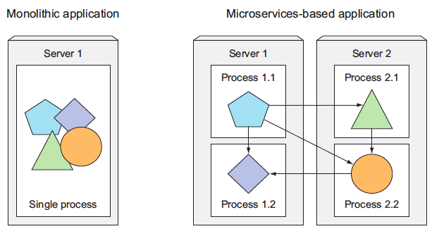
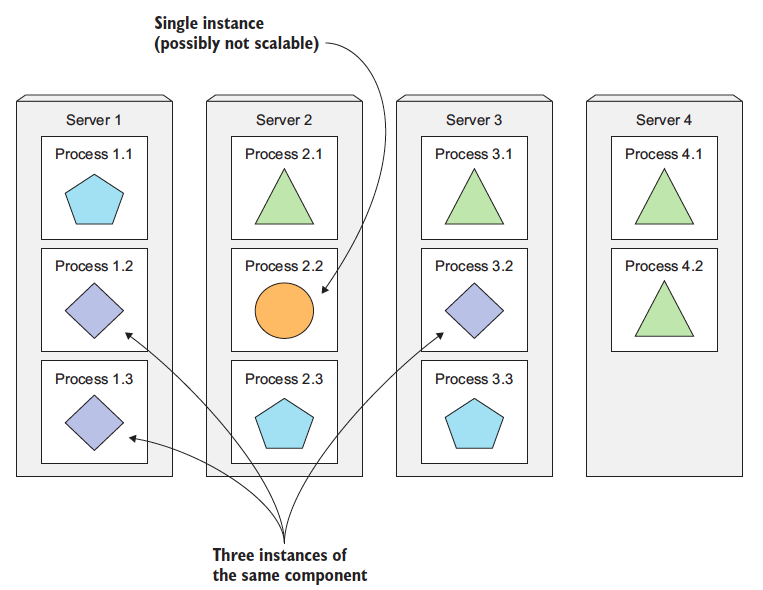
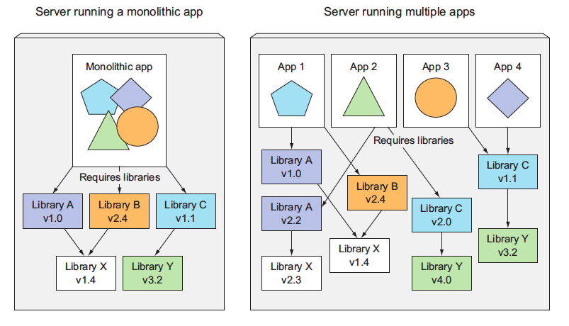

# Kubernetes

## Daftar Isi
+ A. [Apa itu Kubernetes?](#a-apa-itu-kubernetes)
+ B. [Installasi minikube dan kubectl](#b-installasi-minikube-dan-kubectl)
+ C. [Pod](#c-pod)
+ D. [Label](#d-label)
+ E. [Anotasi](#e-anotasi)
+ F. [Menghapus Pod](#f-menghapus-pod)
+ G. [Replication dan Controller Lain](#g-replication-dan-controller-lain)
+ H. [Secrets](#h-secrets)
+ I. [Menyuntikkan Data ke dalam Aplikasi](#i-menyuntikkan-data-ke-dalam-aplikasi)
+ J. [Volume](#i-Volume)
+ K. [Rolling Update](#k-rolling-update)
+ L. [Jobs](#l-jobs)
+ M. [Scaling Aplikasi](#m-scaling-aplikasi)
+ N. [Extend Kubernetes](#n-extend-kubernetes)

## A. Apa itu Kubernetes?
Dalam beberapa tahun terakhir, dunia pengembangan perangkat lunak telah menyaksikan pergeseran signifikan dari aplikasi monolitik tradisional ke paradigma layanan mikro, yang memungkinkan komponen aplikasi untuk dikembangkan, diterapkan, dan diskalakan secara individual, sehingga lebih responsif terhadap kebutuhan bisnis yang terus berubah. Arsitektur layanan mikro, meskipun menawarkan fleksibilitas dan skalabilitas, juga membawa tantangan baru dalam hal konfigurasi, pengawasan, dan penanganan kegagalan sistem, terutama karena peningkatan jumlah komponen dan kompleksitas pengelolaan pusat data. Kubernetes, sebuah platform orkestrasi kontainer terbuka, muncul sebagai jawaban atas tantangan ini, menyediakan mekanisme untuk mengelola dan menjadwalkan komponen aplikasi secara otomatis, serta mengoptimalkan penggunaan sumber daya dan biaya perangkat keras. Lebih lanjut, Kubernetes tidak hanya memberdayakan pengembang untuk menerapkan aplikasi dengan kebebasan dan frekuensi yang lebih besar, tetapi juga memberikan nilai tambah kepada tim operasional dengan kemampuannya untuk secara otomatis memantau, menjadwalkan ulang aplikasi, dan menangani kegagalan perangkat keras, sehingga memungkinkan fokus yang lebih besar pada pengelolaan infrastruktur Kubernetes itu sendiri dan elemen infrastruktur lainnya.

Selanjutnya, kita akan membahas tentang bagaimana kubernetes dapat memisahkan aplikasi menjadi microservices, menskalakan microservices, menerapkan microservices.

### Memisahkan Aplikasi Menjadi Microservices
Setiap microservices sebagai proses independen dan berkomunikasi dengan microservices lainnya melalui antarmuka (API) yang sederhana dan terdefinisi dengan baik. Lihat gambar di bawah ini:



Microservices berkomunikasi menggunakan protokol sinkron seperti HTTP atau protokol asinkron seperti AMQP, seringkali melalui API RESTful, yang sederhana dan tidak terikat pada bahasa pemrograman tertentu, memungkinkan pengembangan dalam berbagai bahasa sesuai kebutuhan. Keunikan microservices sebagai proses mandiri dengan API eksternal yang stabil memungkinkan pengembangan dan penyebaran yang independen; perubahan pada satu layanan tidak memerlukan modifikasi atau penerapan ulang layanan lainnya, selama perubahan API tetap kompatibel.

### Scaling Microservices
Dalam arsitektur microservices, aplikasi dibagi menjadi layanan-layanan kecil yang berfungsi secara independen. Berbeda dengan sistem monolitik yang menskalakan seluruh aplikasi, microservices memungkinkan penskalaan spesifik pada layanan yang mengalami beban tinggi, sementara layanan lain tetap pada kapasitas aslinya. Sebagai contoh, dalam aplikasi e-commerce, jika layanan pencarian produk mengalami lonjakan trafik, hanya layanan tersebut yang perlu diskalakan, tanpa mengganggu layanan pembayaran atau lainnya. Pendekatan ini meningkatkan efisiensi sumber daya dan responsivitas terhadap kebutuhan pengguna. Perhatikan gambar berikut:



Dalam aplikasi monolitik, keterbatasan penskalaan salah satu komponen dapat menghambat penskalaan keseluruhan aplikasi. Dengan pendekatan microservices, aplikasi dibagi menjadi layanan-layanan kecil yang dapat diskalakan secara independen. Jika ada komponen yang sulit diskalakan secara horizontal, kita dapat fokus menskalakannya secara vertikal, sementara komponen lainnya dapat diperluas secara horizontal. Pendekatan ini memberikan fleksibilitas dan optimalisasi dalam penggunaan sumber daya.

### Scaling Microservices
Dalam dunia teknologi, setiap pendekatan memiliki kelebihan dan kekurangannya, termasuk arsitektur microservices. Pada awalnya, ketika sebuah sistem hanya memiliki beberapa komponen, pengelolaan dan penyebarannya relatif sederhana. Dengan sedikit komponen, menentukan penempatan dan interaksi antar komponen menjadi lebih mudah dan intuitif. Namun, seiring bertambahnya jumlah komponen, kompleksitas juga meningkat. Bukan hanya karena ada lebih banyak kombinasi penyebaran, tetapi juga ketergantungan antar komponen tumbuh secara eksponensial, membuat keputusan arsitektural menjadi lebih menantang.

Selain itu, microservices menambahkan lapisan kompleksitas lain dalam hal debugging dan pelacakan. Dengan banyaknya proses dan mesin yang terlibat, melacak alur eksekusi panggilan dapat menjadi tugas yang menantang. Namun, industri teknologi selalu beradaptasi dan mencari solusi. Untuk mengatasi tantangan ini, alat seperti Zipkin telah dikembangkan, yang memungkinkan penelusuran terdistribusi, memberikan wawasan mendalam tentang interaksi antar layanan dalam lingkungan yang kompleks.


> <em>Beberapa aplikasi yang berjalan pada host yang sama mungkin memiliki ketergantungan yang saling bertentangan.</em>

## B. Installasi minikube dan kubectl
Berhubung praktikum sebelumnya sudah melakukan setup untuk Docker, sekarang waktunya melanjutkan menggunakan Docker tersebut dengan kubernetes. Ketika aplikasi yang sudah dibuat sudah dikemas dan dibuat tersedia melalui Docker Hub, aplikasi tersebut dapat dideploy di kluster Kubernetes alih-alih dijalankan di Docker secara langsung. Namun, pertama-tama, kita harus mempersiapkan kluster tersebut terlebih dahulu.

Cara paling sederhana dan tercepat untuk membuat kluster Kubernetes yang berfungsi penuh adalah dengan menggunakan Minikube. Minikube adalah alat yang memungkinkan pengguna untuk menjalankan Kubernetes secara lokal. Dengan Minikube, pengguna dapat mencoba Kubernetes atau mengembangkan aplikasi di lingkungan yang mirip dengan produksi tanpa perlu kluster Kubernetes yang sebenarnya. Minikube berjalan sebagai sebuah kluster Kubernetes single-node di dalam mesin virtual di komputer, memudahkan untuk memulai eksperimen dengan Kubernetes tanpa investasi infrastruktur yang besar.

Kubectl, di sisi lain, adalah Command Line Interface (CLI) untuk berinteraksi dengan kluster Kubernetes. Ini adalah alat esensial bagi siapa saja yang bekerja dengan Kubernetes, memungkinkan pengguna untuk menjalankan command terhadap kluster, seperti membuat dan menghapus sumber daya, melihat status node dan pod, serta banyak lagi. Dengan kubectl, pengguna dapat mengelola kluster dan aplikasi yang berjalan di dalamnya dengan mudah dan efisien.

### 1. Proses Installasi kubectl

#### Sebelum Memulai
Gunakan versi kubectl yang berada dalam satu perbedaan versi minor dari kluster. Misalnya, klien v1.28 dapat berkomunikasi dengan v1.27, v1.28, dan v1.29. Menggunakan kubectl versi terbaru yang kompatibel membantu menghindari masalah yang tidak terduga.

#### A. Install kubectl di Linux
Terdapat 3 cara untuk menginstall kubectl di Linux. Cara tersebut adalah dengan menggunakan curl, npm, dan package management lain. Untuk kali ini akan digunakan cara curl.

1. Download versi terbaru dengan command:
```
curl -LO "https://dl.k8s.io/release/$(curl -L -s https://dl.k8s.io/release/stable.txt)/bin/linux/amd64/kubectl"
```
2. Validasi biner. Download file checksum kubectl:
```
curl -LO "https://dl.k8s.io/release/$(curl -L -s https://dl.k8s.io/release/stable.txt)/bin/linux/amd64/kubectl.sha256"
```
3. Validasi biner kubectl terhadap file checksum:
```
echo "$(cat kubectl.sha256)  kubectl" | sha256sum --check
```
Jika valid, maka outputnya adalah:
```
kubectl: OK
```
Jika gagal, outputnya adalah:
```
kubectl: FAILED
sha256sum: WARNING: 1 computed checksum did NOT match
```
4. Install kubectl
```
sudo install -o root -g root -m 0755 kubectl /usr/local/bin/kubectl
```
5. Tes untuk memastikan versi yang diinstall up to date:
```
kubectl version --client
```
#### B. Install kubectl di macOS
Terdapat 3 cara untuk menginstall kubectl di macOS. Cara tersebut adalah dengan menggunakan curl, Homebrew, dan Macports. Untuk kali ini akan digunakan cara Homebrew.

1. Download versi terbaru dengan command:
```
brew install kubectl
```
2. Tes untuk memastikan versi yang diinstall up to date:
```
kubectl version --client
```
#### C. Install kubectl di Windows
Terdapat 2 cara untuk menginstall kubectl di macOS. Cara tersebut adalah dengan menggunakan curl dan winget. Untuk kali ini akan digunakan cara curl.

1. Download versi terbaru dengan command:
```
curl.exe -LO "https://dl.k8s.io/release/v1.28.3/bin/windows/amd64/kubectl.exe"
```
2. Validasi biner. Download file checksum kubectl:
```
curl.exe -LO "https://dl.k8s.io/v1.28.3/bin/windows/amd64/kubectl.exe.sha256"
```
3. Validasi biner kubectl terhadap file checksum. Gunakan Command Prompt untuk membandingkan output CertUtil's secara manual dengan file checksum yang diumduh:
```
CertUtil -hashfile kubectl.exe SHA256
type kubectl.exe.sha256
```
Gunakan PowerShell untuk mengotomatiskan verifikasi menggunakan operator -eq untuk mendapatkan hasil True atau False
```
$(Get-FileHash -Algorithm SHA256 .\kubectl.exe).Hash -eq $(Get-Content .\kubectl.exe.sha256)
```
4. Append folder binary kubectl ke variabel environment PATH
5. Tes untuk memastikan versi yang diinstall up to date:
```
kubectl version --client
```
#### D. Installasi Minikube
1. Di linux, gunakan command:
```
curl -LO https://storage.googleapis.com/minikube/releases/latest/minikube-linux-amd64
sudo install minikube-linux-amd64 /usr/local/bin/minikube
```
2. Di macOS, gunakan homebrew dan inputkan command:
```
brew install minikube
```
3. Di Windows, cukup download dan jalankan installer untuk versi terbaru. Jika ingin menggunakan PowerShell, inputkan command:
```
New-Item -Path 'c:\' -Name 'minikube' -ItemType Directory -Force
Invoke-WebRequest -OutFile 'c:\minikube\minikube.exe' -Uri 'https://github.com/kubernetes/minikube/releases/latest/download/minikube-windows-amd64.exe' -UseBasicParsing
```
Tambahkan minikube.exe bianry ke PATH. Pastikan PowerShell berhalan sebagai Administrator:
```
New-Item -Path 'c:F\' -Name 'minikube' -ItemType Directory -Force
Invoke-WebRequest -OutFile 'c:\minikube\minikube.exe' -Uri 'https://github.com/kubernetes/minikube/releases/latest/download/minikube-windows-amd64.exe' -UseBasicParsing
```
Setelah installasi minikube sudah dilakukan, mulai kluster Kubernetes dengan command berikut:
```
minikube start
```
Outputnya nanti adalah:
```bash
Starting local Kubernetes cluster...
Starting VM...
SSH-ing files into VM...
...
Kubectl is now configured to use the cluster.
```
Proses untuk menyalakan kluster memakan waktu lebih dari 1 menit, jadi jangan interupsi command sebelum selesai. Untuk memverifikasi apakah kluster telah bekerja, gunakan command kubectl berikut:
```
kubectl cluster-info
```
Outputnya nanti adalah 

```bash
Kubernetes master is running at https://192.168.99.100:8443

kubernetes-dashboard is running at https://192.168.99.100:8443/api/v1/...

KubeDNS is running at https://192.168.99.100:8443/api/v1/namespaces/kube-system/services/kube-dns:dns/proxy
```
Output tersebut menunjukkan bahwa kluster telah berjalan. Selain itu, akan ditunjukkan URL dari berbagai komponen kubernetes, termasuk server API dan web console.

## C. Pod
Membuat Pod di Kubernetes dapat dilakukan dengan menggunakan cli **kubectl** atau dengan mendefinisikan konfigurasi Pod dalam berkas YAML lalu menerapkannya. Di bawah ini adalah langkah-langkah untuk kedua metode tersebut:

#### Metode 1: Menggunakan Command kubectl
Kita dapat membuat Pod secara langsung menggunakan perintah **kubectl run**. Misalnya, untuk membuat Pod yang menjalankan citra nginx:
```
kubectl run nginx-pod --image=nginx --restart=Never
```
nginx-pod: Nama Pod.
--image=nginx: Menentukan citra Docker yang akan digunakan.
--restart = Never untuk memastikan bahwa ini berjalan sebagai Pod. Jika menghilangkan ini, Deployment akan dibuat sebagai gantinya.
Sebagai alternatif, bisa juga menggunakan command **kubectl create**. **kubectl create** adalah command yang lebih umum yang digunakan untuk membuat sumber daya Kubernetes berdasarkan definisi YAML atau JSON. Ini dapat digunakan untuk membuat berbagai sumber daya seperti Deployment, Services, ConfigMaps, dan banyak lagi.

#### Metode 2: Menggunakan File Konfigurasi YAML
Kita dapat mendefinisikan konfigurasi Pod dalam berkas YAML dan kemudian menerapkannya menggunakan **kubectl apply**. Buat file bernama nginx-pod2.yaml dengan isi berikut. Isi ini akan dijelaskan di bagian selanjutnya:
```
apiVersion: v1
kind: Pod
metadata:
  name: nginx-pod
spec:
  containers:
  - name: nginx-container
    image: nginx
```
Kemudian, gunakan **kubectl apply** untuk mengapply file YAML yang telah dibuat
```
kubectl apply -f nginx-pod2.yaml
```
Setelah membuat Pod, verifikasi status pod tersebut dengan command:
```
kubectl get pods
```
Command akan menunjukkan status semua Pod di namespace saat ini. Untuk melihat Pod di semua namespace, gunakan::
```
kubectl get pods --all-namespaces
```
Untuk memeriksa deskriptor YAML dari pod yang ada, gunakan command **kubectl get** dengan opsi **-o yaml** untuk mendapatkan seluruh definisi YAML dari pod, atau dapat menggunakan **-o json** untuk mendapatkan seluruh definisi JSON sebagai ditampilkan dalam listing berikut.
```
kubectl get po nginx-pod -o yaml
```

#### Definisi Pod
Definisi pod terdiri dari beberapa bagian. Pertama, versi API Kubernetes yang digunakan di YAML dan jenis sumber daya yang dijelaskan oleh YAML. Lalu, tiga bagian penting ditemukan di hampir semua sumber daya Kubernetes:

- **Metadata** mencakup nama, namespace, label, dan informasi lain tentang pod.
- **Spesifikasi** berisi deskripsi sebenarnya dari isi pod, seperti container pod, volume, dan data lainnya.
- **Status** berisi informasi terkini tentang pod yang berjalan, seperti kondisi pod, deskripsi dan status setiap container, serta IP internal pod dan informasi dasar lainnya.

Bagian status berisi data runtime read-only yang menunjukkan status sumber daya pada saat tertentu. Saat membuat pod baru, tidak perlu menyediakan bagian status.

Tiga bagian yang dijelaskan sebelumnya menunjukkan struktur khas objek API Kubernetes. Semua objek lainnya memiliki anatomi yang sama sehingga memudahkan pemahaman objek baru.

Menelusuri semua properti individual di YAML sebelumnya tidak masuk akal, jadi, mari lihat seperti apa YAML paling dasar untuk membuat pod.

#### Membuat Deskriptor YAML Sederhana Untuk Sebuah Pod
Buat file bernama **skibidi-toilet.yaml** (di direktori mana pun). Listing berikut menunjukkan keseluruhan isi file.

```yaml
apiVersion: v1
kind: Pod
metadata:
  name: skibidi-toilet
spec:
  containers:
  - image: knrt10/kubia
    name: kubia
    ports:
    - containerPort: 8080
      protocol: TCP
```
Mari periksa deskriptor ini secara mendetail. Deskriptor ini sesuai dengan versi **v1** API Kubernetes. Jenis sumber daya yang dieskripsikan adalah sebuah pod, dengan nama **skibidi-toilet**. Pod tersebut terdiri dari sebuah container tunggal berdasarkan gambar **knrt10/kubia**. Container tersebut mendengarkan pada port **8080** dan mendengarkan di port 8080.

## C. Bermain dengan Pods
#### Mengakses Log Pod
Untuk memeriksa log suatu Pod, gunakan command berikut:
```
kubectl logs nginx-pod
```
#### Menghapus Pod
Untuk menghapus Pod, gunakan command berikut:
```
kubectl delete pod nginx-pod
```
#### Membuat Konfigurasi Pod Multi-Container
Berikut adalah contoh konfigurasi YAML untuk sebuah Pod yang menjalankan dua container:
```
apiVersion: v1
kind: Pod
metadata:
  name: multi-container-pod
spec:
  containers:
  - name: container-1
    image: nginx
    ports:
    - containerPort: 80
  - name: container-2
    image: busybox
    command: ['sh', '-c', 'echo Hello, Kubernetes! && sleep 3600']

```
Penjelasan:
##### metadata.name: Nama Pod adalah pod multi-kontainer.
##### spec.containers: Array yang menyimpan konfigurasi untuk setiap container di Pod.
##### container-1:
###### nama: Nama container pertama adalah container-1.
###### image: Menggunakan image nginx dari Docker Hub.
###### port: Memperlihatkan port 80.
##### container-2:
###### nama: Nama container kedua adalah container-2.
###### image: Ini menggunakan gambar busybox dari Docker Hub.
###### command: Container ini akan menjalankan perintah shell sederhana yang mencetak pesan dan kemudian tidur selama satu jam

#### Deploy Aplikasi
Cara yang paling mudah untuk mendeploy aplikasi adalah dengan menggunakan command **kubectl create**. Dengan ini, aplikasi akan terdeploy dengan komponen yang sesuai tanpa harus mengurus JSON atau YAML:
```bash
kubectl create deployment ngunx-pod --image=knrt10/kubia --port=8080
```
Bagian `--image=knrt10/kubia` menentukan citra kontainer yang ingin dijalankan, dan opsi `--port=8080` memberi tahu Kubernetes bahwa aplikasi mendengarkan pada port 8080.

#### Akses Web Aplikasi
Setelah pod berjalan, bagaimana cara mengaksesnya? Setiap pod mendapatkan alamat IP-nya sendiri, tetapi alamat ini bersifat internal dalam kluster dan tidak dapat diakses dari luar kluster. Untuk membuat pod dapat diakses dari luar ekspos melalui Service Object. 

Buat services khusus bertipe LoadBalancer karena jika membuat services biasa (layanan ClusterIP), sebagai pod, services ini juga hanya dapat diakses dari dalam kluster. Dengan membuat services tipe LoadBalancer, sebuah load balancer eksternal akan dibuat dan dapat terhubung ke pod melalui IP publik load balancer.

#### Membuat Service Object
Untuk membuat services, beri tahu Kubernetes untuk mengekspos Deployment yang telah dibuat sebelumnya:

```bash
kubectl expose deploy ngunx-pod --type=LoadBalancer --name ngunx-pod-http
```
Outputnya nanti adalah:
```
service/ngunx-pod-http exposed
```
**Penting:** Gunakan singkatan `deploy`, bukan `deployment`. Sebagian besar jenis sumber daya memiliki singkatan seperti ini sehingga tidak perlu mengetikkan nama lengkapnya (misalnya, `po` untuk `pods`, `svc` untuk `services`, dan seterusnya).

#### Listing Services
Output command tersebut menyebutkan sebuah service bernama `kubia-http`. Services adalah objek seperti halnya Pod dan Node, sehingga dapat dilihat Service Object yang baru dibuat dengan menjalankan command **kubectl get services | svc**, seperti yang ditunjukkan pada listing berikut:
```bash
kubectl get svc
```
**Penting**: - Minikube tidak mendukung services LoadBalancer, jadi services ini tidak akan pernah mendapatkan IP eksternal.Tetapi services ini dapat diakses melalui port eksternalnya. Jadi IP eksternal akan selalu pending dalam hal ini. Ketika menggunakan minikube, bisa didapatkan IP dan port melalui akses services dengan menjalankan command:
```
minikube service ngunx-pod-http
```

#### Scaling Microservices Secara Horizontal
Salah satu kelebihan Kubernetes adalah kemudahan untuk melakukan scaling deployment. Disini akan ditingkatkan jumlah instance yang berjalan menjadi tiga. Gunakan command:
```
kubectl get deploy
```
```bash
NAME    READY   UP-TO-DATE   AVAILABLE   AGE
ngunx-pod    1/1     1            1           4m58s
```

Untuk meningkatkan jumlah replika pod yang dibuat, gunakan command:
```
kubectl scale deploy ngunx-pod --replicas=3
```

Listing lagi deployment yang sudah dibuat untuk melihat jumlah replica dengan command:
```
kubectl get deploy
```

Karena jumlah pod telah meningkat ke tiga, listing semua pod dengan command berikut. Akan ditunjukkan bahwa terdapat 3 pods, bukan 1:
```
kubectl get pods
```


#### Menunjukkan Informasi IP Pod dan Node Pod Ketika Listing
Jika diperhatikan dengan seksama, command **kubectl get pods**  tidak menampilkan informasi apa pun tentang node yang dijadwalkan untuk pod. Ini karena informasi ini biasanya bukan informasi yang penting.

Tetapi dapat diminta kolom tambahan untuk ditampilkan menggunakan opsi **-o wide**. Saat listing, opsi ini menunjukkan IP pod dan node tempat pod berjalan:
```
kubectl get pods -o wide
```

#### Mengakses Dashboard Menggunakan Minikube
Untuk membuka dashboard di browser ketika menggunakan minikube untuk menjalankan kluster kubernetes, jalankan command berikut:
```
minikube dashboard
```

##### Port Forwarding ke Port di Pod
Saat ingin berkomunikasi dengan pod tertentu tanpa melalui layanan (untuk debugging atau alasan lainnya), Kubernetes memungkinkan konfigurasi port forwarding ke pod. Hal ini dilakukan melalui perintah **kubectl port-forward**. Command ini akan meneruskan port lokal mesin **8888** ke port **8080** dari pod **nginx-pod**:
```
kubectl port-forward nginx-pod 8888:8080
```
Di terminal yang berbeda, sekarang dapat menggunakan curl untuk mengirim permintaan HTTP ke pod melalui proksi port-forward kubectl yang berjalan di localhost:8888:
```
curl localhost:8888
```
Outputnya nanti adalah:
> You've hit nginx-pod

Menggunakan port forwarding seperti ini adalah cara efektif untuk menguji masing-masing pod.

## D. Label
Pengorganisasian pod dan semua objek Kubernetes lainnya dilakukan melalui label. Label adalah fitur Kubernetes yang sederhana namun sangat kuat untuk mengatur tidak hanya pod, tetapi semua sumber daya Kubernetes lainnya. Label adalah pasangan key value arbitrer yang dilampirkan ke sumber daya, yang kemudian digunakan saat memilih sumber daya menggunakan label selector (sumber daya difilter berdasarkan apakah sumber daya tersebut menyertakan label yang ditentukan dalam selector).

#### Menentukan Label Saat Membuat Pod
Sekarang, lihat label beraksi dengan membuat pod baru dengan dua label. Buat file baru bernama **nginx-pod-label.yaml** dengan listing konten berikut:
```yaml
apiVersion: v1
kind: Pod
metadata:
  name: nginx-pod-label
  labels:
    creation_method: manual
    env: prod
    skibidi: toilet
spec:
  containers:
  - image: knrt10/kubia
    name: kubia
    ports:
    - containerPort: 8080
      protocol: TCP
```

Masukkan label *creation_method=manual*, *env=data.labels*, dan *skibidi=toilet*. Buat pod berikut:
```
kubectl create -f nginx-pod-label.yaml
```

Command **kubectl get po** tidak mencantumkan label apa pun secara default, namun dapat dilihatnya dengan menggunakan switch **--show-labels**:
```
kubectl get po --show-labels
```

Daripada mencantumkan semua label, jika hanya tertarik pada label tertentu, tentukan dengan switch **-L** dan menampilkan masing-masing label di kolomnya sendiri. Buat listing pod lagi dan tampilkan kolom untuk dua label yang telah  dilampirkan ke pod **nginx-pod-label**:
```
kubectl get po -L skibidi
```

#### Memodifikasi Label Pod

Label juga dapat ditambahkan dan dimodifikasi pada pod yang sudah ada. Karena pod **nginx-pod-label** juga dibuat secara manual, mari tambahkan label **creation_method=manual** ke dalamnya:
```
kubectl label po nginx-pod-label creation_method=manual
```

Sekarang, mari kita ubah juga label **env=prod** menjadi **env=debug** pada pod **nginx-pod-label**, untuk melihat bagaimana label yang ada dapat diubah. Gunakan opsi **--overwrite** saat mengubah label yang ada.
```
kubectl label po nginx-pod-label env=debug --overwrite
```

#### Listing Pod Melalui Selector Label
Label selector dapat memilih sumber daya berdasarkan apakah sumber daya tersebut
- Berisi (atau tidak berisi) label dengan key tertentu
- Berisi label dengan key dan value tertentu
- Berisi label dengan key tertentu, tetapi valuenya tidak sama dengan yang ditentukan

Mari gunakan label selector pada pod yang telah dibuat sejauh ini. Untuk melihat semua pod yang dibuat secara manual (Diberi labelnya dengan **creation_method=manual**), masukkan command berikut:
```
kubectl get po -l creation_method=manual
```


Dan yang tidak memiliki label **env**:
```
kubectl get po -l '!env'
```

Outputnya nanti adalah:
```bash
NAME           READY     STATUS    RESTARTS   AGE
kubia-5k788    1/1       Running   1          9d
kubia-7zxwj    1/1       Running   1          5d
kubia-bsksp    1/1       Running   1          5d
kubia-manual   1/1       Running   0          22h
```

Pastikan untuk menggunakan tanda kutip tunggal di sekitar **!env**, sehingga bash shell tidak mengevaluasi tanda seru.

#### Menggunakan Beberapa Kondisi Dalam Label Selector
Selector juga dapat menyertakan beberapa kriteria yang dipisahkan koma. Sumber daya harus cocok dengan semuanya agar sesuai dengan selector. Jalankan dengan command berikut:
```
kubectl get po -l '!env , !creation_method' --show-labels
```

#### Menggunakan label Untuk Mengkategorikan Node Pekerja
Pod bukan hanya jenis sumber daya kubernetes yang dapat dilampirkan labelnya. Label dapat dilampirkan ke sumber daya Kubernetes apa pun, termasuk node.

Bayangkan salah satu node di kluster berisi GPU yang dimaksudkan untuk digunakan untuk komputasi GPU tujuan umum. Jika ingin menambahkan label ke node yang menampilkan fitur ini,tambahkan label **gpu=true** ke salah satu node (pilih salah satu dari listing yang direturn oleh **kubectl get node**):
```
kubectl label node minikube gpu=true
```
Outputnya nanti adalah:
> node/minikube labeled

Sekarang kamu dapat menggunakan label selector saat membuat listing node, seperti yang dilakukan sebelumnya dengan pod. Cantumkan hanya node yang menyertakan label *gpu=true*:
```
kubectl get node -l gpu=true
```
Outputnya nanti adalah:
```bash
NAME       STATUS    ROLES     AGE       VERSION
minikube   Ready     master    9d        v1.10.0
```

Seperti yang diharapkan, hanya satu node yang memiliki label ini. Untuk membuat listing semua node dan meminta kubectl untuk menampilkan kolom tambahan yang menunjukkan value label gpu setiap node, masukkan command berikut:
```
kubectl dapatkan node -L gpu
```
Outputnya nanti adalah:
```bash
NAME       STATUS    ROLES     AGE       VERSION   GPU
minikube   Ready     master    9d        v1.10.0   true
```

#### Menjadwalkan Pod ke Node Tertentu
Sekarang bayangkan jika ingin menerapkan pod baru yang memerlukan GPU untuk melakukan tugasnya. Untuk meminta penjadwal agar hanya memilih di antara node yang menyediakan GPU, tambahkan pemilih node ke YAML pod. Buat file bernama **skibidi-gpu.yaml** dengan konten listing berikut dan kemudian gunakan **kubectl create -f skibidi-gpu.yaml** untuk membuat pod. Isi filenya adalah:
```yaml
apiVersion: v1
kind: Pod
metadata:
  name: skibidi-gpu
spec:
  nodeSelector:
    gpu: "true"
  containers:
  - image: luksa/kubia
    name: kubia
```

Setelah menambahkan kolom **nodeSelector** di bawah bagian spec, saat membuat pod, penjadwal hanya akan memilih di antara node yang berisi label *gpu=true* (yang hanya merupakan satu node dalam kasus ini).

#### Menjadwalkan ke Satu Node Tertentu
Demikian pula, sebuah pod dapat dijadwalkan ke sebuah node yang tepat, karena setiap node juga memiliki label unik dengan key **kubernetes.io/hostname** dan value yang disetel ke nama host sebenarnya dari node tersebut. Contohnya seperti berikut:
```
kubectl get nodes --show-labels
```
Outputnya nanti adalah:
```bash
NAME       STATUS    ROLES     AGE       VERSION   LABELS
minikube   Ready     master    9d        v1.10.0   beta.kubernetes.io/arch=amd64,beta.kubernetes.io/os=linux,gpu=true,kubernetes.io/hostname=minikube,node-role.kubernetes.io/master=
```
Namun menyetel *nodeSelector* ke node tertentu berdasarkan label nama host dapat menyebabkan pod tidak dapat dijadwalkan jika node sedang offline.

## E. Anotasi
Selain label lain, pod dan objek lain juga dapat berisi anotasi. Mereka juga merupakan pasangan key value, jadi pada dasarnya mereka mirip dengan label, namun tidak dimaksudkan untuk menyimpan informasi identitas. Mereka tidak bisa digunakan untuk mengelompokkan objek seperti yang bisa dilakukan label. Meskipun objek dapat dipilih melalui label selector, tidak ada pemilih anotasi. Di sisi lain, anotasi dapat menampung informasi yang jauh lebih besar dan terutama dimaksudkan untuk digunakan oleh alat. Anotasi tertentu secara otomatis ditambahkan ke objek oleh Kubernetes, namun anotasi lainnya ditambahkan oleh pengguna secara manual.

Kegunaan yang bagus untuk membuat anotasi pada pod adalah dengan menambahkan deskripsi pada setiap pod atau objek API lainnya sehingga setiap orang yang menggunakan kluster dapat dengan cepat mencari informasi tentang setiap objek individual.

#### Mencari anotasi objek
Mari kita lihat contoh anotasi yang ditambahkan Kubernetes secara otomatis ke pod yang dibuat di bagian sebelumnya. Untuk melihat anotasinya, perlu meminta YAML lengkap dari pod tersebut atau menggunakan command `kubectl describe`. Gunakan opsi pertama dalam listing berikut:
```
kubectl get po nginx-pod -o yaml
```
Outputnya nanti adalah:
```bash
apiVersion: v1
kind: Pod
metadata:
  annotations:
    kubernetes.io/created-by: |
      {"kind":"SerializedReference", "apiVersion":"v1",
      "reference":{"kind":"ReplicationController", "namespace":"default", ...
```

Tanpa menjelaskan terlalu banyak detail, seperti yang dilihat, anotasi `kubernetes.io/created-by` menyimpan data JSON tentang objek yang membuat pod. Itu bukanlah sesuatu yang ingin dimasukkan ke dalam label. Label harus **pendek**, sedangkan anotasi bisa berisi gumpalan data yang relatif besar **(total hingga 256 KB)**.

**Penting**:- Anotasi kubernetes.io/created-by tidak digunakan lagi dalam versi
`1.8` dan akan dihapus di `1.9`, jadi seharusnya tidak ada lagi di YAML.

#### Menambah dan mengubah anotasi
Anotasi jelas dapat ditambahkan ke pod pada waktu pembuatan, sama seperti label. Tapi bisa juga ditambahkan setelah menggunakan command berikut. Mari coba tambahkan ini ke pod `nginx-pod` sekarang:
```
kubectl annotate pod nginx-pod knrt10.github.io/someannotation="skibidi toilet"
```

Telah ditambahkan anotasi `knrt10.github.io/someannotation` dengan value `skibidi toilet`. Sebaiknya gunakan format ini untuk key anotasi guna mencegah benturan key. Saat alat atau libraries berbeda menambahkan anotasi ke objek, alat atau libraries tersebut mungkin secara tidak sengaja menimpa anotasi satu sama lain jika tidak menggunakan awalan unik seperti yang dilakukan di sini. Periksa pod sekarang menggunakan command berikut:
```
kubectl describe po nginx-pod
```

## F. Namespace
Mari kita listing dulu semua namespace di cluster kita, ketik command berikut:
```
kubectl get ns
```
Hingga saat ini, kita hanya beroperasi di namespace `default`. Saat membuat daftar sumber daya dengan perintah `kubectl get`, kita tidak pernah menentukan namespace secara eksplisit, jadi kubectl selalu menggunakan namespace default secara default, dan hanya menampilkan objek dalam namespace tersebut. Namun seperti yang bisa dilihat dari listing, namespace kube-public dan kube-system juga ada. Mari kita lihat pod-pod yang termasuk dalam namespace `kube-system`, dengan memerintahkan kubectl untuk mencantumkan pod-pod di namespace tersebut saja:
```
kubectl get po -n kube-system
```

Jelas dari nama namespacenya bahwa ini adalah sumber daya yang terkait dengan sistem Kubernetes itu sendiri. Dengan menempatkannya di namespace terpisah ini, semuanya tetap terorganisir dengan baik. Jika semuanya ada di namespace default, tercampur dengan sumber daya yang dibuat sendiri, akan kesulitan untuk melihat apa yang termasuk di dalamnya, dan mungkin secara tidak sengaja bisa menghapus sumber daya sistem.

Namespace memungkinkan pemisahan sumber daya yang tidak dimiliki bersama ke dalam grup yang tidak tumpang tindih. Jika beberapa pengguna atau grup pengguna menggunakan klaster Kubernetes yang sama, dan masing-masing mengelola kumpulan sumber dayanya sendiri-sendiri, maka masing-masing pengguna harus menggunakan namespacenya sendiri. Dengan cara ini, mereka tidak perlu berhati-hati untuk tidak secara tidak sengaja mengubah atau menghapus sumber daya pengguna lain dan tidak perlu khawatir dengan konflik nama, karena namespace menyediakan ruang lingkup untuk nama sumber daya, seperti yang telah disebutkan .

#### Membuat Sebuah namespace
Namespace adalah sumber daya Kubernetes seperti sumber daya lainnya, sehingga kita dapat membuatnya dengan memposting sebuah
file YAML ke server API Kubernetes. Buat file bernama **custom-namespace.yaml**

Kita akan membuat file bernama **custom-namespace.yaml** (di direktori mana pun). Listing berikut menunjukkan  seluruh isi file:
```yml
apiVersion: v1
kind: Namespace
metadata:
  name: custom-namespace
```

Sekarang ketikkan command berikut:
```
kubectl create -f custom-namespace.yaml
```
Outputnya nanti adalah:

#### Mengelola Objek di namespace Lain
Untuk membuat sumber daya di namespace yang dibuat, ubah isi nginx-pod dengan konfigurasi berikut:
```
apiVersion: v1
kind: Pod
metadata:
  name: mypod
  namespace: custom-namespace
spec:
  containers:
  
name: mycontainer
  image: nginx:latest
  livenessProbe:
    httpGet:
      path: /index.html
      port: 80
    initialDelaySeconds: 3
    periodSeconds: 3
name: mysecondcontainer
image: busybox
```

Kita telah menambahkan entri `namespace: custom-namespace` ke bagian metadata, atau tentukan namespace saat membuat sumber daya command `kubectl create`:
```
kubectl create -f nginx-pod.yaml
```

Kubernetes sekarang memiliki dua pod dengan nama yang sama (kubia-manual). Salah satunya ada di `default`
namespace, dan yang lainnya ada di `custom-namespace`.

Saat membuat daftar, mendeskripsikan, memodifikasi, atau menghapus objek di namespace lain, teruskan flag `--namespace (atau -n)` ke kubectl. Jika tidak menentukan namespace, kubectl akan melakukan tindakan di namespace default yang dikonfigurasi dalam konteks kubectl saat ini. Namespace konteks saat ini dan konteks saat ini sendiri dapat diubah melalui command `kubectl config`.

#### Memahami Isolasi yang Disediakan oleh namespace
Untuk mengakhiri bagian tentang namespace, penting untuk memahami apa yang tidak disediakan oleh namespace, setidaknya secara bawaan. Meskipun namespace memungkinkan objek diisolasi ke dalam kelompok-kelompok yang berbeda, memfasilitasi operasi hanya pada objek yang termasuk dalam namespace tertentu, namespace tidak secara otomatis menyediakan isolasi terhadap objek yang sedang berjalan. Sebagai ilustrasi, seseorang mungkin beranggapan bahwa ketika pengguna yang berbeda menjalankan pod di namespace yang berbeda, pod-pod tersebut akan terisolasi dan tidak dapat berkomunikasi satu sama lain. Namun, kenyataannya tidak selalu seperti itu. Apakah sebuah namespace menyediakan isolasi jaringan atau tidak tergantung pada solusi jaringan yang diintegrasikan dengan Kubernetes. Jika solusi tersebut tidak menyediakan isolasi jaringan antar namespace, maka pod di namespace 'foo' yang mengetahui alamat IP dari pod di namespace 'bar' dapat dengan bebas mengirimkan lalu lintas, seperti permintaan HTTP, ke pod tersebut.

## F. Menghapus Pod
Kita telah membuat sejumlah pod yang seharusnya sudah berjalan. Jika mengikuti dari awal, seharusnya terdapat 5 pod di namespace `default` dan satu di namespace `custom-namespace`. Kita akan menghentikan semuanya sekarang, karena kita tidak membutuhkannya lagi.

### Menghapus Pod Berdasarkan Nama
Mari kita hapus dulu nama pod `nginx-pod`:
```
kubectl delete po nginx-pod
```

### Menghapus Pod Berdasarkan Label Selector
Daripada menentukan setiap pod yang akan dihapus berdasarkan namanya, sekarang akan menggunakan apa yang telah dipelajari
tentang label selector untuk menghentikan pod yang menyertakan label `creation_method=manual`, sehingga dapat dihapus menggunakan label selector:
```
kubectl delete po -l creation_method=manual
```

### Menghapus pod dengan menghapus seluruh namespace
Oke, kembali ke pod yang sebenarnya. Bagaimana dengan pod di `custom-namespace`? Kita tidak lagi membutuhkan pod di namespace tersebut, atau namespace itu sendiri. Kita dapat menghapus seluruh namespace menggunakan command berikut. Semua pod di dalam ruang kerja itu akan dihapus secara otomatis:
```
kubectl delete ns custom-namespace
```
Outputnya nanti adalah:
> namespace "custom-namespace" deleted

### Menghapus Semua Pod di Namespace, Sekaligus Mempertahankan Namespace
Kali ini, alih-alih menghapus pod tertentu, beri tahu Kubernetes untuk menghapus semua pod di namespace saat ini dengan menggunakan opsi --all:
```
kubectl delete po --all
```
Outputnya nanti adalah:
```bash
pod "kubia-pjxrs" deleted
pod "kubia-xvfxp" deleted
pod "kubia-zb95q" deleted
```
Akan tetapi, jika menggunakan command `kubectl get po`, akan terlihat bahwa semua pod dihentikan, namun pod baru yang sebelumnya tidak ada, telah muncul. Tidak peduli berapa kali kita menghapus semua pod, pod baru bernama kubia-something akan muncul.

Ingat saat membuat pod pertama dengan perintah `kubectl run`. Pod tidak terbuat secara langsung, melainkan membuat `ReplicationController`, yang kemudian membuat pod. Segera setelah menghapus pod yang dibuat oleh ReplicationController, pod baru akan segera dibuat. Untuk menghapus pod, perlu **menghapus ReplicationController**.

### Hapus Hampir Semua Sumber Daya di namespace
Untuk menghapus ReplicationController dan podnya, serta semua services yang dibuat, dengan menghapus semua sumber daya di namespace saat ini dengan command:
```
kubectl delete all --all
```
Outputnya nanti adalah:
```bash
pod "kubia-5gknm" deleted
pod "kubia-h62k7" deleted
pod "kubia-x4nsb" deleted
replicationcontroller "kubia" deleted
service "kubernetes" deleted
service "kubia-http" deleted
```

Command pertama menentukan bahwa kita menghapus semua jenis sumber daya, dan opsi --all menentukan kita bahwa menghapus semua contoh sumber daya alih-alih menentukannya berdasarkan nama

Saat menghapus sumber daya, kubectl akan mencetak nama setiap sumber daya yang dihapus. Dalam listing, kita akan melihat kubia ReplicationController dan Layanan `kubia-http` yang dibuat sebelumnya.

**Catatan**:- Perintah kubectl delete all --all juga menghapus service kubernetes, namun akan dibuat ulang secara otomatis dalam beberapa saat.

## G. Replication dan Controller Lain
Sejauh ini kita telah belajar cara membuat, mengawasi, dan mengelola pods secara manual. Namun dalam kasus penggunaan di dunia nyata, kita ingin agar penerapan tetap berjalan secara otomatis dan tetap sehat tanpa intervensi manual apa pun. Untuk melakukan hal ini, buat jenis sumber daya lain seperti **ReplicationControllers** atau **Deployments** yang kemudian membuat dan mengelola pod sebenarnya.

Saat membuat pod yang tidak dikelola (seperti yang dibuat sebelumnya), sebuah node kluster dipilih untuk menjalankan pod tersebut dan kemudian containernya dijalankan pada node tersebut. Sekarang, kita akan mengetahui bahwa Kubernetes kemudian memantau container tersebut dan secara otomatis memulai ulang jika gagal. Namun jika seluruh node gagal, pod pada node tersebut akan hilang dan tidak akan diganti dengan yang baru, kecuali pod tersebut dikelola oleh ReplicationControllers atau sejenisnya yang telah disebutkan sebelumnya.

Sekarang kita akan mempelajari bagaimana Kubernetes memeriksa apakah sebuah container masih hidup dan memulai ulang jika tidak. Kita juga akan mempelajari cara menjalankan pod terkelola, baik yang berjalan tanpa batas waktu maupun yang menjalankan satu tugas lalu berhenti.

#### Menjaga Pod Tetap Sehat
Salah satu manfaat utama menggunakan Kubernetes adalah kemampuan untuk memberikan daftar container dan membiarkan container tersebut tetap berjalan di suatu tempat di cluster. Caranya dengan membuat sumber daya Pod dan membiarkan Kubernetes memilih node pekerja untuknya dan menjalankan container pod pada node tersebut. Namun bagaimana jika salah satu kontainer tersebut mati? Bagaimana jika semua wadah dalam satu buah pod mati?

Segera setelah sebuah pod dijadwalkan pada sebuah node, Kubelet pada node tersebut akan menjalankan containernya dan, sejak saat itu, menjaga container tersebut tetap berjalan selama pod tersebut masih ada. Jika proses utama container mengalami crash, Kubelet akan memulai ulang container tersebut. Jika aplikasi mempunyai bug yang menyebabkannya crash sesekali, Kubernetes akan memulai ulang secara otomatis, sehingga bahkan tanpa melakukan sesuatu yang khusus pada aplikasi itu sendiri, menjalankan aplikasi di Kubernetes secara otomatis memberikan kemampuan untuk menyembuhkan dirinya sendiri.

Namun terkadang aplikasi berhenti bekerja tanpa prosesnya terhenti. Misalnya, aplikasi Java dengan kebocoran memori akan mulai menampilkan `OutOfMemoryErrors`, namun proses JVM akan tetap berjalan. Akan sangat bagus jika suatu aplikasi memberi sinyal kepada Kubernetes bahwa aplikasi tersebut tidak lagi berfungsi dengan baik dan meminta Kubernetes memulai ulang aplikasi tersebut.

Container yang mogok akan dimulai ulang secara otomatis, jadi mungkin kita berpikir kita dapat menangkap jenis kesalahan ini di aplikasi dan keluar dari proses saat kesalahan tersebut terjadi. Kita tentu bisa melakukannya, namun tetap saja tidak menyelesaikan semua masalah kita.

Misalnya, bagaimana dengan situasi ketika aplikasi kita berhenti merespons karena berada dalam infinite atau kebuntuan? Untuk memastikan aplikasi dimulai ulang dalam kasus seperti ini, kita harus memeriksa kesehatan aplikasi dari luar dan tidak bergantung pada aplikasi yang melakukannya secara internal.

#### Liveness Probes
Kubernetes dapat memeriksa apakah sebuah container masih hidup melalui `liveness probes`. Kita dapat menentukan pemeriksaan keaktifan untuk setiap container dalam spesifikasi pod. Kubernetes dapat menyelidiki container menggunakan salah satu dari tiga mekanisme berikut:

- Probe `HTTP GET` melakukan permintaan HTTP GET pada alamat IP container, port, dan jalur yang ditentukan. Jika pemeriksaan menerima respons dan kode respons tidak menunjukkan kesalahan **(jika kode respons HTTP adalah 2xx atau 3xx)**, maka pemeriksaan dianggap berhasil. Jika server mengembalikan kode respons kesalahan atau tidak merespons sama sekali, pemeriksaan dianggap gagal dan sebagai hasilnya, container akan dimulai ulang.

- Probe `TCP Socket` mencoba membuka koneksi TCP ke port yang ditentukan dalam container. Jika koneksi berhasil dibuat, pemeriksaan berhasil. Jika tidak, kontainer akan dimulai ulang.

- Probe `Exec` mengeksekusi perintah arbitrer di dalam kontainer dan memeriksa kode status keluar dari perintah tersebut. Jika kode statusnya 0, pemeriksaan berhasil. Semua penyelidikan lainnya dianggap gagal.

#### Membuat Liveness Probes
Mari kita pelajari bagaimana seseorang dapat menambahkan liveness probe ke aplikasi Node.js mereka. Mengingat aplikasi tersebut adalah aplikasi web, maka masuk akal untuk menambahkan liveness probe yang memeriksa apakah server web melayani permintaan dengan benar. Namun, mengingat aplikasi Node.js tersebut sangat sederhana dan tidak mungkin mengalami kegagalan, perlu ada cara untuk membuat aplikasi tersebut gagal secara artifisial.

Sebagai demonstrasi liveness probe, aplikasi perlu dimodifikasi sedikit. Aplikasi tersebut harus diatur agar mengembalikan 500 Internal Server Error HTTP status code setelah melayani lima permintaan pertama dengan benar. Dengan kata lain, setelah menangani lima permintaan awal dengan sukses, aplikasi akan mulai mengembalikan kesalahan untuk setiap permintaan berikutnya. Berkat liveness probe, ketika kondisi ini terjadi, aplikasi akan di-restart, memungkinkannya kembali menangani permintaan klien dengan benar.

Buat file dengan nama **liveness-probe** dengan isi konten berikut:
```yml
apiVersion: v1
kind: Pod
metadata:
  name: liveness-probe
spec:
  containers:
  - image: knrt10/kubia-unhealthy
    name: kubia
    livenessProbe:
      httpGet:
        path:
        port: 8080  
```  

Deskriptor pod mendefinisikan probe liveness probe httpGet, yang memberi tahu Kubernetes untuk melakukan permintaan HTTP GET secara berkala di jalur / di porta 8080 untuk menentukan apakah kontainer masih sehat. Permintaan ini dimulai segera setelah kontainer dijalankan.

Setelah lima permintaan seperti itu (atau permintaan klien yang sebenarnya), aplikasi kita mulai mengembalikan status HTTP `kode 500`, yang akan dianggap oleh Kubernetes sebagai kegagalan probe, dan dengan demikian akan memulai ulang kontainer.

## H. Secrets
#### Memahami Secrets
Rahasia adalah objek yang menyimpan data sensitif seperti kata sandi atau kunci API. Secret digunakan untuk menyimpan data sensitif dengan cara yang lebih aman daripada ConfigMaps biasa atau variabel lingkungan Mengelola secrets secara efektif membantu menjaga keamanan dan integritas aplikasi.

Jenis-jenis Secrets
Opaque: Data yang ditentukan pengguna secara Arbitrary.
kubernetes.io/service-account-token: Data token untuk akun services.
kubernetes.io/dockercfg: Berkas berseri ~/.dockercfg untuk digunakan dengan registri Docker.
kubernetes.io/dockerconfigjson: Berkas ~/.docker/config.json yang diserialisasi.

#### Membuat Secrets Secara Manual
Buat secrets secara langsung dengan menggunakan command kubectl:
```
kubectl create secret generic my-secret --from-literal=key1=value1 --from-literal=key2=value2
``` 
#### Menggunakan Secrets di Pod
Sebagai Variabel Environment:
Kita dapat mengekspos data secrets ke sebuah Pod sebagai variabel lingkungan. Berikut adalah contoh bagaimana kita dapat mendefinisikannya dalam spesifikasi Pod:
```
apiVersion: v1
kind: Pod
metadata:
  name: secret-env-pod
spec:
  containers:
  - name: mycontainer
    image: myimage:latest
    env:
    - name: SECRET_USERNAME
      valueFrom:
        secretKeyRef:
          name: my-secret
          key: username
    - name: SECRET_PASSWORD
      valueFrom:
        secretKeyRef:
          name: my-secret
          key: password
  restartPolicy: Never
``` 
#### Menggunakan Secrets di Volume
Secrets juga dapat dipasang sebagai volume untuk diakses oleh container di dalam Pod. Berikut ini contohnya:
```
apiVersion: v1
kind: Pod
metadata:
  name: secret-volume-pod
spec:
  containers:
  - name: mycontainer
    image: myimage:latest
    volumeMounts:
    - name: secret-volume
      mountPath: "/etc/secret-data"
      readOnly: true
  volumes:
  - name: secret-volume
    secret:
      secretName: my-secret
  restartPolicy: Never
``` 
#### Melihat Secrets
Untuk melihat secrets yang dibuat, gunakan perintah **kubectl get secret**:
```
kubectl get secrets
```
Untuk melihat detail konten secrets tertentu (dalam format YAML), gunakan:
```
kubectl get secret my-secret -o yaml
```

#### Menghapus Secrets
Jika perlu menghapus secrets, lakukan dengan perintah berikut:
```
kubectl delete secret my-secret
```

## I. Menyuntikkan Data ke dalam Aplikasi
Memasukkan data ke dalam aplikasi di Kubernetes dapat dilakukan dengan menggunakan berbagai objek seperti ConfigMaps dan Secrets. Bagian ini akan memandu proses pembuatan, pengelolaan, dan penggunaan objek untuk memasukkan data ke dalam aplikasi.

#### Memahami ConfigMap
ConfigMap adalah objek API yang digunakan untuk menyimpan data non-rahasia dalam pasangan nilai kunci. Ini memungkinkan kita untuk memisahkan konfigurasi khusus lingkungan dari image container, sehingga membuat aplikasi lebih portabel.

Use Case ConfigMaps
Menyimpan file konfigurasi.
Menetapkan variabel environment untuk container.
Mengkonfigurasikan argumen command-line untuk aplikasi.

#### Membuat dan Menggunakan ConfigMaps
Berikut isi file yaml yang bisa digunakan untuk membuat suatu ConfigMap:
```
apiVersion: v1
kind: ConfigMap
metadata:
  name: myconfigmap
data:
  mykey: mydata
  anotherkey: anotherdata
```

#### Menggunakan ConfigMaps di Pod
Untuk menggunakan ConfigMap, sebuah Pod perlu mereferensikan ConfigMap. Contoh referensi ConfigMap dalam definisi Pod:
```
apiVersion: v1
kind: Pod
metadata:
  name: skabada
spec:
  containers:
  - name: mycontainer
    image: myimage
    env:
      - name: MY_KEY
        valueFrom:
          configMapKeyRef:
            name: myconfigmap
            key: mykey
```

#### Menggunakan Variabel Environment dalam Aplikasi
Akses variabel lingkungan menggunakan metode standar untuk bahasa pemrograman. Berikut contohnya untuk python:
```
import os
my_key = os.environ.get('MY_KEY')
my_secret_key = os.environ.get('MY_SECRET_KEY')
```

#### Praktik Terbaik untuk Injeksi Data
Gunakan Konfigurasi yang Tidak Dapat Diubah
Jika memungkinkan, buat ulang Pod alih-alih memodifikasinya untuk memastikan konfigurasi diterapkan dengan benar.

Gunakan Key Tertentu
Saat mereferensikan ConfigMaps dan Secrets, tentukan Key untuk membuat konfigurasi menjadi eksplisit.

Validasi Konfigurasi
Pastikan kode aplikasi memvalidasi konfigurasi dan jelas gagal jika konfigurasi tidak valid.

## J. Volume
Di Kubernetes, volume pada dasarnya adalah sebuah direktori, mungkin berisi beberapa data di dalamnya, yang dapat diakses oleh container di dalam pod. Siklus hidup sebuah volume terikat dengan siklus hidup pod. Artinya jika sebuah pod mati, volumenya juga akan hilang, dan data mungkin hilang. Namun, Kubernetes mendukung banyak jenis volume, dan beberapa di antaranya tetap bertahan melampaui siklus hidup pod.

#### Jenis Volume
#####  emptyDir: 
1. Direktori kosong sederhana yang digunakan oleh container sebagai ruang awal atau untuk berbagi data antar container dalam sebuah pod.
2. Data di dalam blankDir bersifat sementara (yaitu, data tersebut akan hilang ketika pod dihapus).
#####  hostPath:
1. Memasang direktori atau file dari sistem file node host ke dalam pod.
2. Berguna untuk pengaturan node tunggal.
#####  nfs:
1. Memasang share NFS ke dalam pod.
#####  persistentVolumeClaim (PVC):
1. Menyediakan cara bagi pod untuk mengklaim sumber daya penyimpanan persisten yang ditentukan dalam PersistentVolume.
2. Data dapat bertahan saat pod dihidupkan ulang.
#####  configMap, secret:
1. Mengizinkan pod mengakses data konfigurasi dan rahasia yang masing-masing disimpan di objek ConfigMap dan Secret Kubernetes.
#####  projected:
1. Memungkinkan kita memproyeksikan beberapa sumber volume yang ada ke dalam direktori yang sama.
#####  csi:
1. API standar untuk menghubungkan sistem penyimpanan ke Kubernetes menggunakan Container Storage Interface (CSI).
#####  downwardAPI:
1. Mengekspos info pod dan sistem ke container.
#####  azureDisk, awsElasticBlockStore, gcePersistentDisk, etc.:
1. Cloud provider-specific storage solutions.

#### Mengonfigurasi Volume Pod
```
apiVersion: v1
kind: Pod
metadata:
  name: my-pod
spec:
  containers:
  - name: my-container
    image: my-image
    volumeMounts:
    - mountPath: /data
      name: my-volume
  volumes:
  - name: my-volume
    emptyDir: {}
```
Dalam contoh ini, volume emptyDir bernama my-volume dibuat dan dipasang ke dalam container /data.

## K. Rolling Update
Rolling Update adalah fitur penting di Kubernetes yang memungkinkan ktia memperbarui versi aplikasi yang sedang berjalan tanpa downtime. Hal ini dilakukan dengan memperbarui instance Pod secara bertahap dengan yang baru.

Saat melakukan pembaruan berkelanjutan, Kubernetes secara bertahap mengganti pod versi lama dengan versi baru, memastikan bahwa tidak semua pod dihapus secara bersamaan. Hal ini memastikan aplikasi tetap tersedia bagi pengguna selama proses pembaruan.

#### Cara Kerja Rolling Update
1. Pod Baru Telah Dibuat: Kubernetes memulai dengan membuat pod dengan aplikasi versi baru.
2. Pod Lama Dihapus: Saat pod baru sudah siap, pod lama akan dihentikan.
3. Peluncuran Progresif: Pembaruan dilakukan secara progresif, memastikan bahwa sejumlah pod tertentu selalu tersedia dan tidak lebih dari jumlah pod tertentu yang tidak tersedia selama pembaruan.

#### Konfigurasi Rolling Update
Berikut contoh isi konfigurasi rolling update:
```
apiVersion: apps/v1
kind: Deployment
metadata:
  name: my-deployment
spec:
  replicas: 3
  selector:
    matchLabels:
      app: my-app
  strategy:
    type: RollingUpdate
    rollingUpdate:
      maxUnavailable: 1
      maxSurge: 1
  template:
    metadata:
      labels:
        app: my-app
    spec:
      containers:
      - name: my-container
        image: my-image:latest
```
Melakukan Rolling Update
Untuk melakukan rolling update, ubah gambar container pod:
```
kubectl set image deployment/my-deployment my-container=my-image:v2
```
Perintah ini memperbarui image container bernama my-container dalam penerapan my-deployment ke my-image:v2.

#### Rollback Rolling Update
Jika ada yang tidak beres dengan rolling update, Kubernetes memungkinkan untuk melakukan rollback ke penerapan sebelumnya. Gunakan command berikut:
```
kubectl rollout undo deployment/my-deployment
```

#### Monitor Rollback Update
Untuk melihat status rollback update gunakan command:
```
kubectl rollout status deployment/my-deployment
```

## L. Jobs
Di Kubernetes, Job adalah konstruksi khusus yang dirancang untuk menjalankan satu atau lebih Pod hingga selesai. Berbeda dengan Pod atau Deployment yang mana container dapat berjalan tanpa batas waktu jika tidak dihentikan, Job mengelola eksekusi satu atau lebih Pod dan memastikan bahwa sebuah sejumlah tertentu berhasil dihentikan. Pekerjaan berguna untuk menjalankan proses batch, tugas satu kali, atau tugas lain apa pun yang perlu dijalankan hingga selesai, bukan dijalankan terus-menerus.

#### Jenis Jobs
#####  Jobs Non-paralel:
Sebuah Job yang mengelola sebuah Pod dan memastikan Pod tersebut berjalan hingga selesai.
#####  Jobs Paralel dengan Jumlah Penyelesaian Tetap:
Sebuah Job yang menjalankan beberapa Pod secara paralel dan menunggu hingga sejumlah Pod tertentu berhasil diselesaikan.
#####  Jobs Paralel dengan Work Queue:
Jobs dimana beberapa Pod bekerja di luar antrian yang sama. Hal ini berguna untuk mendistribusikan pekerjaan ke beberapa worker.

#### Konfigurasi Jobs
Berikut contoh konfigurasi Job:
```
apiVersion: batch/v1
kind: Job
metadata:
  name: my-job
spec:
  template:
    spec:
      containers:
      - name: my-container
        image: my-image
        command: ["do-something"]
      restartPolicy: Never
```
Dalam contoh ini, Job akan membuat sebuah Pod yang menjalankan perintah do-something di dalam container my-image, dan restartPolicy diatur ke Never, yang berarti Pod tidak akan di-restart jika gagal atau selesai.

#### Konfigurasi Jobs Paralel
Untuk menjalankan beberapa Pod secara paralel pada sebuah Jobs,kita dapat menentukan kolom completion dan parallelism:
#####
completion: Menentukan jumlah pod yang berhasil diselesaikan dan pekerjaan harus dijalankan.
#####
parallelism: Menentukan jumlah maksimum Pod yang diinginkan untuk dijalankan pada waktu tertentu.RestartPolicy diatur ke Never, yang berarti Pod tidak akan di-restart jika gagal atau selesai.

Berikut contoh konfigurasi Job paralel
```
apiVersion: batch/v1
kind: Job
metadata:
  name: parallel-job
spec:
  completions: 10
  parallelism: 3
  template:
    spec:
      containers:
      - name: worker
        image: my-worker-image
      restartPolicy: Never
```

#### Memonitor dan Menghapus Jobs
Pantau status sebuah Job dengan kubectl:
```
kubectl describe job my-job
```

Hapus sebuah Job dengan kubectl:
```
kubectl delete job my-job
```
Saat menghapus sebuah Job menggunakan kubectl, semua Pod yang terkait dengan Job tersebut juga akan terhapus.

#### CronJobs
Kubernetes juga mendukung CronJobs, yang merupakan jenis Jobs yang berjalan pada waktu atau interval tertentu.Kubernetes menggunakan sintaksis yang sama dengan sintaksis cron UNIX untuk menjadwalkan pekerjaan berulang.

## M. Scaling Aplikasi
Scaling aplikasi adalah aspek mendasar dari Kubernetes, yang memungkinkan kita untuk menyesuaikan jumlah replika pod berdasarkan permintaan atau beban pada aplikasi. Scaling memastikan bahwa aplikasi memiliki jumlah sumber daya yang tepat (seperti Pod) untuk menangani permintaan saat ini. Kubernetes menyediakan dua jenis scaling utama, yaitu Horizontal Pod Autoscaling (HPA) dan Vertical Pod Autoscaling (VPA).

#### Horizontal Pod Autoscaling (HPA):
HPA secara otomatis menyesuaikan jumlah replika pod dalam penerapan atau kumpulan replika berdasarkan metrik yang diamati seperti penggunaan CPU atau metrik apa pun yang tersedia di server metrik Kubernetes. Pengontrol HPA secara berkala menyesuaikan jumlah replika dalam penerapan atau kumpulan replika agar sesuai dengan penggunaan CPU rata-rata yang diamati dengan target yang ditentukan oleh pengguna. HPA menanyakan pemanfaatan sumber daya terhadap metrik yang ditentukan dalam setiap definisi HorizontalPodAutoscaler.

Berikut contoh konfigurasi HPA:
```
apiVersion: autoscaling/v1
kind: HorizontalPodAutoscaler
metadata:
  name: my-application-hpa
spec:
  scaleTargetRef:
    apiVersion: apps/v1
    kind: Deployment
    name: my-application
  minReplicas: 1
  maxReplicas: 10
  targetCPUUtilizationPercentage: 80
```
Dalam contoh ini, HPA diatur untuk menskalakan penerapan aplikasi. HPA memastikan bahwa pemanfaatan CPU tetap sekitar 80%. Jika pemanfaatannya melebihi, maka akan menambah lebih banyak replika (hingga maksimal 10).

#### Vertical Pod Autoscaling (VPA)
Scaling ini melibatkan penambahan atau pengurangan sumber daya (CPU, memori) dari sebuah pod. VPA secara otomatis menyesuaikan cadangan CPU dan memori untuk pod, membantu memastikan ketersediaan sumber daya untuk aplikasi. VPA memantau penggunaan CPU dan memori pod. Berdasarkan riwayat penggunaan dan nilai yang ditetapkan dalam objek VPA, VPA akan menyesuaikan permintaan CPU dan memori.

#### Scaling Manual
Selain scaling otomatis, kita juga dapat scaling aplikasi secara manual di Kubernetes:
```
kubectl scale deployment my-application --replicas=3
```

## N. Extend Kubernetes
1. Custom Resources dan Custom Resource Definitions (CRDs):
#### Sumber Daya Kustom (Custom Resources): Ini adalah ekstensi dari API Kubernetes yang memungkinkan kita membuat, mengonfigurasi, dan mengelola jenis sumber daya kustom.
#### Definisi Sumber Daya Kustom (CRDs): CRDs memungkinkan pengguna mendefinisikan jenis sumber daya kustom mereka sendiri. Setelah CRD dibuat, pengguna dapat mengelola objek kustom menggunakan kubectl seperti sumber daya bawaan (misalnya, Pod atau Layanan).
2. API Aggregation Layer:
#### Kubernetes mendukung pengaturan server API tambahan dan memiliki server API Kubernetes utama mengarahkan lalu lintas ke server tambahan tersebut berdasarkan jalur API mereka. Ini berguna untuk memperluas API Kubernetes tanpa memodifikasi server API inti.
3. Kontroler:
#### Kontroler adalah loop kontrol yang mengawasi keadaan sistem Kubernetes dan membuat perubahan untuk memindahkan keadaan saat ini menuju keadaan yang diinginkan. Dengan menulis kontroler kustom, pengguna dapat mengotomatisasi dan memperluas fungsionalitas Kubernetes.
#### Operator Pattern: Sebuah operator adalah metode untuk mengemas, menyebarkan, dan mengelola aplikasi Kubernetes menggunakan sumber daya kustom dan kontroler kustom. Operator memperluas Kubernetes untuk mengotomatisasi manajemen seluruh siklus hidup aplikasi tertentu.
4. Scheduler Extensibility:
#### Kubernetes memungkinkan kita menggunakan beberapa penjadwal atau menggantikan penjadwal bawaan dengan kustom. Ini berguna jika kita memiliki persyaratan penjadwalan khusus yang tidak dipenuhi oleh penjadwal bawaan.
5. Webhook:
#### Kubernetes mendukung beberapa jenis webhook, termasuk:
##### Webhook Penerimaan (Admission Webhooks): Ini memungkinkan kita untuk mencegat dan memodifikasi permintaan ke server API Kubernetes.
##### Webhook Otentikasi dan Otorisasi: Ini memungkinkan sistem eksternal untuk berintegrasi dengan proses otentikasi dan otorisasi Kubernetes.
6. Plugin Jaringan:
#### Kubernetes mendukung plugin Container Network Interface (CNI), memungkinkan pengguna untuk menerapkan solusi jaringan kustom.
7. Plugin Penyimpanan:
#### Kubernetes mendukung sistem plugin untuk penyimpanan, memungkinkan pengguna menambahkan dukungan untuk backend penyimpanan tambahan.
8. Service Mesh:
#### Meskipun bukan mekanisme ekstensi langsung dari Kubernetes, service mesh seperti Istio dan Linkerd menyediakan kemampuan jaringan yang ditingkatkan.
9. Plugin Kubectl:
#### kubectl dapat diperluas dengan perintah kustom dengan membuat plugin. Plugin-plugin ini adalah binari mandiri yang dianggap sebagai sub-perintah kubectl baru.
10. Server API Kustom:
#### Pengguna tingkat lanjut dapat menerapkan server API kustom sepenuhnya untuk menggantikan yang bawaan dari Kubernetes. Ini adalah tugas yang kompleks tetapi menawarkan fleksibilitas maksimum.
